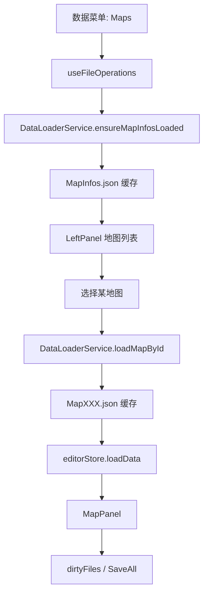

# 变更提案: add-map-module-and-extra-data-loading

## 元信息
```yaml
类型: 新功能
方案类型: implementation
优先级: P1
状态: 草稿
创建: 2026-03-11
```

---

## 1. 需求

### 背景
当前编辑器已经把一部分 RPG Maker 数据文件纳入统一管理，但仍缺少 `Classes.json` 职业数据和 `CommonEvents.json` 公共事件数据。另一方面，地图数据量通常远大于常规数据库文件，现有 `DataLoaderService` 基于固定 manifest 的预载策略不适合直接加载全部 `MapXXX.json`，否则会带来明显的启动开销与内存浪费。

### 目标
- 将 `Classes.json` 和 `CommonEvents.json` 作为普通数据库文件接入现有菜单、缓存、切换、保存体系。
- 新增地图模块，先通过 `MapInfos.json` 建立地图索引，再在用户选择具体地图时按需读取对应 `MapXXX.json`。
- 地图文件一旦被打开，必须像现有数据文件一样进入统一缓存、脏标记和 SaveAll 链路。
- 保持当前 Wails + React + Zustand 架构，不做与本需求无关的大规模重构。

### 约束条件
```yaml
时间约束: 当前迭代内完成最小可用地图模块
性能约束: 禁止在工作区加载时一次性读取全部 MapXXX.json
兼容性约束: 不破坏现有 data/quest/projectile 模式与保存语义
业务约束: 地图模块先提供最小可用编辑能力，范围控制在地图基础信息与事件数据的统一管理接入
```

### 验收标准
- [ ] 工作区加载后，`Classes.json` 与 `CommonEvents.json` 可通过菜单打开、编辑并纳入 SaveAll。
- [ ] 新增地图入口后，系统先加载 `MapInfos.json` 作为地图列表，不预载全部地图内容。
- [ ] 用户选择具体地图时，系统按需读取对应 `MapXXX.json`，并将其纳入统一缓存与脏标记体系。
- [ ] 地图模式下左侧列表可展示地图索引，主内容区可展示地图面板。
- [ ] 现有 quest/projectile/普通 data 文件流程不回归，构建与测试通过。

---

## 2. 方案

### 技术方案
本次改造采用“普通数据库扩展 + 地图双层管理”的单方案实现：

- `Classes.json` 与 `CommonEvents.json` 继续复用现有普通数据文件链路，仅补充后端类型识别、前端菜单映射和预载 manifest。
- 地图拆分为两个层级：
  - `MapInfos.json` 作为地图索引缓存，用于展示可选地图列表。
  - `MapXXX.json` 作为地图内容缓存，仅在用户选中某张地图时读取。
- `DataLoaderService` 增加地图专用入口，例如“确保地图索引已加载”和“按地图 ID/文件名加载地图内容”，但不把地图内容加入现有全量预载 manifest。
- `editorStore` 扩展地图相关状态，使左侧列表可以在地图模式下使用 `MapInfos`，同时让当前地图文件继续复用现有 `currentData/currentFilePath/dirtyFiles/dirtyItemIndexes` 保存模型。
- `MainContent` 增加 `MapPanel`，以最小可用方式承接地图基础编辑；`LeftPanel` 根据当前模式切换普通列表与地图列表数据源。

### 影响范围
```yaml
涉及模块:
  - app.go: 数据菜单增加 Classes/CommonEvents/Maps 入口
  - backend/services/workspace_service.go: 数据类型识别与可选文件补充
  - frontend/src/services/DataLoaderService.ts: 普通数据预载扩展、地图索引加载、地图按需加载
  - frontend/src/hooks/useFileOperations.ts: 菜单事件处理与地图加载流程
  - frontend/src/stores/editorStore.ts: 地图状态、统一缓存与保存接入
  - frontend/src/types/index.ts: map 相关类型与状态扩展
  - frontend/src/components/layout/LeftPanel.tsx: 地图列表渲染
  - frontend/src/components/layout/MainContent.tsx: MapPanel 接入
  - frontend/src/components/panels/MapPanel.tsx: 新增地图面板
预计变更文件: 8-11
```

### 风险评估
| 风险 | 等级 | 应对 |
|------|------|------|
| 将地图并入全量预载导致启动性能劣化 | 高 | 明确把地图内容排除在 `preloadManifest()` 之外，仅保留 `MapInfos.json` 索引加载 |
| 左侧列表沿用普通数据库数组假设，导致地图模式渲染失效 | 高 | 在 `LeftPanel` 中基于 `uiMode/currentFileType` 分流数据源，地图模式单独使用 `MapInfos` |
| 地图文件未注册缓存键，SaveAll 漏保存 | 中 | 地图索引和地图内容都通过 `DataLoaderService.cacheFileData()` 或专用注册入口统一入缓存 |
| 地图面板范围失控，演变为完整地图编辑器重构 | 中 | 严格限制本次范围为地图基础信息和统一管理接入，不实现完整地图编辑器能力 |
| 新增类型分支破坏现有 data/quest/projectile 行为 | 中 | 保持 Classes/CommonEvents 仍走 `data`，地图单独扩展 `map` 分支，并通过构建和测试兜底 |

---

## 3. 技术设计

### 架构设计


### 数据模型
| 字段 | 类型 | 说明 |
|------|------|------|
| `MapInfoEntry.id` | `number` | 地图 ID，对应 `MapXXX.json` 编号 |
| `MapInfoEntry.name` | `string` | 地图显示名 |
| `MapInfoEntry.order` | `number` | 地图排序或列表顺序 |
| `currentMapInfos` | `MapInfoEntry[]` | 当前工作区已加载的地图索引列表 |
| `currentMapId` | `number` | 当前打开的地图 ID |
| `currentFileType = 'map'` | `FileType` | 当前文件为地图内容 |

### 状态与加载设计
- 普通数据库文件继续由 `preloadManifest()` 负责预载。
- `MapInfos.json` 不进入普通 manifest，而由地图入口首次访问时单独加载并缓存。
- `MapXXX.json` 通过地图列表点击触发，读取后写入统一缓存，并调用 `editorStore.loadData(..., 'map')` 或等价地图加载入口。
- 地图文件保存仍复用现有 `saveAllFiles()`，前提是地图内容文件路径已进入缓存与脏标记集合。

---

## 4. 核心场景

### 场景: 打开职业与公共事件数据
**模块**: 数据菜单 / 文件加载
**条件**: 已打开有效工作区
**行为**: 用户从菜单选择 `Classes.json` 或 `CommonEvents.json`
**结果**: 文件按普通 data 类型加载到左侧列表与现有属性/备注面板

### 场景: 进入地图模式并加载地图索引
**模块**: 地图模块 / DataLoaderService
**条件**: 已打开有效工作区且存在 `MapInfos.json`
**行为**: 用户从菜单进入 Maps
**结果**: 系统只加载 `MapInfos.json`，左侧列表展示全部地图项，不读取全部 `MapXXX.json`

### 场景: 打开具体地图并纳入统一管理
**模块**: 地图模块 / editorStore / SaveAll
**条件**: 地图索引已加载，用户选择具体地图
**行为**: 系统按需读取该地图对应的 `MapXXX.json` 并显示在 `MapPanel`
**结果**: 当前地图文件进入统一缓存、脏标记与保存链路

---

## 5. 技术决策

### add-map-module-and-extra-data-loading#D001: 地图采用索引与内容分层加载
**日期**: 2026-03-11
**状态**: ✅采纳
**背景**: 地图文件数量可能远大于普通数据库文件，现有固定 manifest 预载策略无法承受全量地图加载成本。
**选项分析**:
| 选项 | 优点 | 缺点 |
|------|------|------|
| A: 将 `MapInfos.json` 和全部 `MapXXX.json` 一并加入现有 manifest | 实现简单，复用现有预载逻辑 | 启动期 I/O 和内存开销过大，违背按需加载要求 |
| B: `MapInfos.json` 单独作为索引缓存，`MapXXX.json` 仅在选中地图时按需加载 | 满足性能约束，职责清晰，易接入统一缓存与保存体系 | 需要扩展地图模式与左侧列表分流逻辑 |
**决策**: 选择方案 B
**理由**: 方案 B 既满足“统一管理”目标，又严格符合“地图只在使用时导入”的性能约束，是当前架构下成本最低且可维护的实现。
**影响**: `DataLoaderService`、`useFileOperations`、`editorStore`、`LeftPanel`、`MainContent`、`MapPanel`
