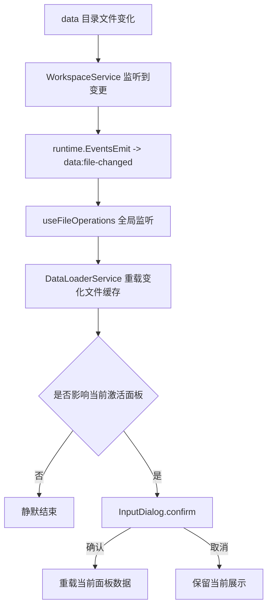

# 变更提案: add-base-data-file-watch-and-reload

## 元信息
```yaml
类型: 新功能
方案类型: implementation
优先级: P1
状态: 草稿
创建: 2026-03-11
```

---

## 1. 需求

### 背景
当前编辑器已经能统一管理普通数据库文件、任务数据、弹道数据和地图数据，但当外部工具或其他编辑器修改 `data/` 目录下的基础数据文件时，应用内缓存不会自动同步，当前面板可能继续展示旧数据。对于任务面板和弹道面板，这个问题更明显，因为它们不仅依赖当前文件，还依赖多份基础数据库缓存。

### 目标
- 监视工作区 `data/` 目录下的基础数据文件变化。
- 某个基础数据文件发生变化时，自动重载对应缓存数据。
- 如果变化的数据正被当前激活面板使用，则先提示用户确认，再重载当前面板数据。
- 保持现有 Wails + React + Zustand 架构，不引入与本需求无关的状态管理重构。

### 非目标
- 不实现全量依赖图或通用资源图谱系统。
- 不在本次引入前端轮询文件时间戳方案。
- 不扩展为脚本目录监听或图片资源目录监听。

### 约束条件
```yaml
性能约束: 不允许因为监听功能而重新引入全量地图预载
交互约束: 仅当变化文件影响当前激活面板时才弹确认框
架构约束: 非命中面板的数据变化应静默刷新缓存，不打断用户
兼容性约束: 不能破坏现有 data/quest/projectile/map 的打开、缓存和保存流程
```

### 验收标准
- [ ] 工作区打开后，系统能持续监视 `data/` 目录下受支持的数据文件变化。
- [ ] 非当前激活面板依赖的数据文件变化时，系统会静默刷新对应缓存。
- [ ] 当前激活面板正在使用的数据文件变化时，系统会弹出确认框，提示用户当前数据已变化。
- [ ] 用户点击确认后，当前面板会重新加载正确的数据，而不是只刷新后台缓存。
- [ ] `QuestPanel` 与 `ProjectilePanel` 的依赖缓存变化后，面板选项与引用展示会同步刷新。
- [ ] 构建、类型检查和相关测试通过。

---

## 2. 方案

### 技术方案
本次改造采用“后端文件监听 + 前端事件分流 + 面板级白名单判定”的单方案实现：

- 后端为当前工作区的 `data/` 目录增加文件监听服务，识别目标 JSON 文件变化后，通过 Wails 向前端发出统一事件。
- 前端在全局文件操作入口订阅该事件，判断变化文件是否仅需刷新缓存，还是已经影响当前激活面板。
- 命中当前激活面板时，复用现有 `InputDialog.confirm(...)` 弹出确认框；用户确认后执行当前数据重载。
- 面板命中判定先采用最小可行白名单：
  - `PropertyPanel` / `NotePanel`: 当前文件命中
  - `MapPanel`: `MapInfos.json` 或当前地图文件命中
  - `QuestPanel`: `Quests.json` 以及其依赖的基础数据库文件命中
  - `ProjectilePanel`: 当前弹道文件以及其依赖的基础数据库文件命中
- `DataLoaderService` 负责基础数据缓存重载与地图索引/地图文件按需重载，不把该能力散落到各面板。

### 影响范围
```yaml
涉及模块:
  - app.go: 监听服务生命周期、后端事件发射桥接
  - backend/services/workspace_service.go: 工作区 data 目录监听管理
  - frontend/src/services/DataLoaderService.ts: 单文件缓存重载能力、地图重载能力
  - frontend/src/hooks/useFileOperations.ts: 监听后端文件变化事件、弹确认框、执行当前面板重载
  - frontend/src/stores/editorStore.ts: 读取当前激活文件/模式/地图索引状态
  - frontend/src/components/common/InputDialog.tsx: 复用确认框，无需结构变更
预计变更文件: 4-6
```

### 风险评估
| 风险 | 等级 | 应对 |
|------|------|------|
| 文件监听在保存自身文件时误报，导致用户被重复打断 | 高 | 监听事件增加最小去抖与“最近本地保存”豁免窗口 |
| Quest/Projectile 只刷新缓存但不刷新面板，导致 UI 仍显示旧选项 | 高 | 将“依赖缓存变化”纳入当前面板命中判定，确认后执行当前面板重载 |
| 地图索引变化时误把整个地图模块全量重载 | 中 | `MapInfos.json` 和 `MapXXX.json` 分开处理，继续保持懒加载 |
| 监听范围过宽带来无效事件和额外复杂度 | 中 | 第一版只监听 `data/` 目录下受支持的 JSON 文件 |
| 多次连续文件变化弹出重复确认框 | 中 | 前端增加进行中标记或按文件聚合，避免重复弹窗 |

---

## 3. 技术设计

### 事件流


### 数据与事件模型
| 字段 | 类型 | 说明 |
|------|------|------|
| `filePath` | `string` | 发生变化的完整路径 |
| `fileName` | `string` | 文件名，如 `Actors.json` |
| `changeType` | `string` | 变更类型，至少支持 `write/create/rename/remove` |
| `source` | `string` | 事件来源，区分文件监听与应用内保存（如需要） |
| `reloadCurrent` | `() => Promise<void>` | 前端针对当前激活面板的统一重载入口 |

### 面板命中判定
- `property` / `note`
  - `changedFilePath === currentFilePath`
- `map`
  - `changedFilePath === currentFilePath`
  - 或当前处于地图索引视图且 `changedFileName === 'MapInfos.json'`
- `quest`
  - 当前 `uiMode === 'quest'`
  - 且变化文件属于 `Quests.json`、`Actors.json`、`Enemies.json`、`Items.json`、`Weapons.json`、`Armors.json`、`System.json`
- `projectile`
  - 当前 `uiMode === 'projectile'`
  - 且变化文件属于当前弹道文件、`Animations.json`、`Actors.json`、`Enemies.json`、`Weapons.json`、`Skills.json`

### 重载策略
- 静默缓存重载:
  - 普通数据库文件调用单文件重载入口，更新 `DataLoaderService` 缓存。
  - `MapInfos.json` 只刷新地图索引缓存。
  - `MapXXX.json` 只刷新对应地图缓存，不全量扫地图。
- 当前面板重载:
  - 普通 `data` 文件: 重新读取当前文件并调用 `editorStore.loadData(...)`
  - `quest` / `projectile`: 在刷新依赖缓存后，重新打开当前主文件，触发面板重新取值
  - `map`: 当前地图文件重新打开；若是地图索引视图则重新加载 `MapInfos.json`

---

## 4. 核心场景

### 场景: 外部修改未当前使用的基础数据文件
**条件**: 当前正在编辑其他文件或其他模式
**行为**: 监听到如 `Actors.json` 变化，但当前面板不依赖该文件
**结果**: 系统静默刷新缓存，不弹窗

### 场景: 当前属性面板正在编辑被改动的文件
**条件**: `PropertyPanel` 正在显示 `Actors.json`
**行为**: 外部工具写入 `Actors.json`
**结果**: 系统提示当前数据已变化，用户确认后重载当前文件

### 场景: 任务面板依赖缓存发生变化
**条件**: 当前处于 `QuestPanel`
**行为**: 外部工具修改 `Items.json`
**结果**: 系统提示依赖数据已变化，用户确认后重载任务数据与相关下拉选项

### 场景: 地图索引变化
**条件**: 当前处于地图列表或地图面板
**行为**: 外部工具修改 `MapInfos.json`
**结果**: 系统在命中地图面板时弹确认框，确认后刷新地图索引；未命中则静默刷新索引缓存

---

## 5. 技术决策

### add-base-data-file-watch-and-reload#D001: 使用后端文件监听而不是前端轮询
**日期**: 2026-03-11
**状态**: ✅采纳
**背景**: 文件变化来自工作区本地磁盘，前端本身不适合承担目录轮询职责。
**选项分析**:
| 选项 | 优点 | 缺点 |
|------|------|------|
| A: 前端定时轮询文件时间戳 | 实现集中在前端 | 额外 I/O 高、职责错位、地图与依赖文件处理复杂 |
| B: 后端监听 data 目录并发事件到前端 | 更贴近文件系统、职责清晰、可直接桥接 Wails 事件 | 需要补一层监听生命周期管理 |
**决策**: 选择方案 B
**理由**: 当前架构已有 Wails 事件桥，后端监听是更自然的职责边界，也更利于后续扩展到更多资源类型。

### add-base-data-file-watch-and-reload#D002: 当前面板判定采用白名单，不做全量依赖图
**日期**: 2026-03-11
**状态**: ✅采纳
**背景**: 当前需求只要求“命中当前激活面板时先确认再重载”，不需要构建通用依赖系统。
**选项分析**:
| 选项 | 优点 | 缺点 |
|------|------|------|
| A: 建立全量面板-文件依赖图 | 理论完整 | 实现成本高，超出当前需求范围 |
| B: 基于 `uiMode` 和文件白名单做最小判定 | 实现快、风险可控、便于验证 | 后续如果新增复杂面板，需要补白名单 |
**决策**: 选择方案 B
**理由**: 现阶段 `quest`、`projectile`、`map` 的依赖集合明确，白名单足够支撑产品行为。
