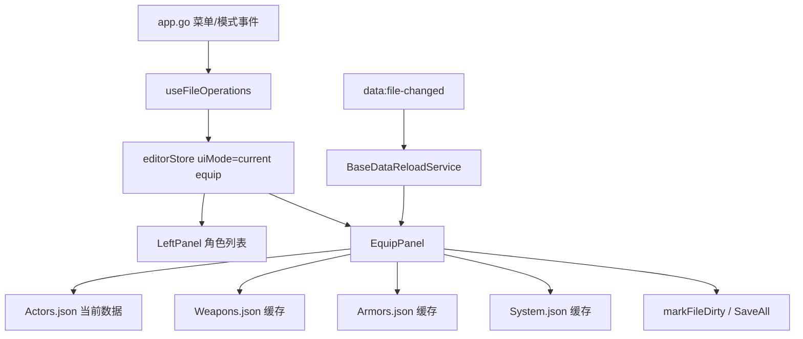

# 变更提案: add-equip-mode-and-system-equip-type-config

## 元信息
```yaml
类型: 新功能
方案类型: implementation
优先级: P1
状态: 草稿
创建: 2026-03-12
```

---

## 1. 需求

### 背景
当前编辑器已经具备属性、备注、任务、弹道、地图等模式，但角色装备相关配置仍缺少专用编辑入口。现有需求希望新增“装备模式”，以角色为主体统一编辑装备槽类型、默认装备和系统级装备类型归类规则。

### 目标
- 新增 `equip` 模式，并以 `Actors.json` 为主数据源展示角色列表与角色装备配置。
- 装备面板依赖 `Actors.json`、`Weapons.json`、`Armors.json`、`System.json` 四份数据。
- 装备槽类型列表来自 `$dataSystem.equipTypes`，保留其原始索引语义；索引 `0` 为空字符串，视为“无类型”。
- 每个装备槽对应一个装备下拉，依据该槽保存的装备类型索引，决定从武器库或防具库中筛选候选项。
- 在 `System.json` 中新增“武器型装备类型列表”，用于判定某个 `equipType` 应从 `Weapons` 还是 `Armors` 查找。

### 约束条件
```yaml
时间约束: 本次只做方案设计，不进入业务代码实现
性能约束:
  - 不新增新的全量预载策略
  - 继续复用当前基础数据库缓存
兼容性约束:
  - 不破坏现有 property/note/quest/projectile/map 模式
  - 保存链路必须兼容现有 dirtyFiles + SaveAll 体系
业务约束:
  - equip mode 以 Actors.json 为主文件，不引入新的物理数据文件
  - Weapons/Armors/System 仅作为依赖数据和部分跨文件保存目标
```

### 验收标准
- [ ] 菜单和主内容区支持切换到 `equip` 模式，且角色切换时装备面板同步刷新。
- [ ] 装备槽类型来源于 `System.equipTypes`，面板展示时保留类型索引，`0` 视为无类型。
- [ ] 装备候选项按槽类型自动区分武器/防具数据源，并按 `wtypeId/atypeId` 精确筛选。
- [ ] 系统数据中可维护“武器型装备类型列表”，并纳入统一缓存、脏标记和 SaveAll 链路。
- [ ] 外部数据监听命中 `Actors.json`、`Weapons.json`、`Armors.json`、`System.json` 时，装备模式可正确刷新或提示重载。

---

## 2. 方案

### 技术方案
本次采用“`Actors.json` 主文件 + `equip` 专用 UI 模式”的方案，而不是新增独立 `equip fileType`。原因是装备配置的最终归属仍在角色数据上，继续复用当前文件打开、缓存、脏标记、SaveAll 与外部变更监听链路，侵入最小且实现风险最低。

实现上分四层处理：
- 模式层：扩展 `EditorMode`，在菜单、`editorStore`、`MainContent` 中接入 `equip` 模式。
- 数据层：继续使用 `Actors.json` 作为当前文件；在装备面板中额外读取 `Weapons.json`、`Armors.json`、`System.json` 缓存，并派生装备槽类型与候选装备列表。
- 保存层：角色装备槽与默认装备回写 `Actors.json`；系统级“武器型装备类型列表”回写 `System.json`；二者都进入现有 `markFileDirty + markItemDirty + SaveAll` 体系。
- 监听层：在当前面板命中规则中补充 `equip` 模式的依赖白名单，确保依赖文件变化时能静默刷新或确认重载。

### 影响范围
```yaml
涉及模块:
  - frontend/src/types/index.ts: 扩展 equip 模式相关类型定义
  - frontend/src/stores/editorStore.ts: 接入 equip 模式状态切换
  - frontend/src/hooks/useFileOperations.ts: 菜单事件、模式切换、当前文件管理
  - frontend/src/components/layout/MainContent.tsx: 渲染 EquipPanel
  - frontend/src/components/layout/LeftPanel.tsx: 继续复用角色列表，不进入地图分支
  - frontend/src/components/panels/EquipPanel.tsx: 新增装备模式核心面板
  - frontend/src/services/DataLoaderService.ts: 复用现有缓存，不新增独立 equip 文件类型
  - frontend/src/services/BaseDataReloadService.ts: 增加 equip 模式依赖命中规则
  - app.go: 数据菜单/模式菜单新增装备入口
预计变更文件: 8-10
```

### 风险评估
| 风险 | 等级 | 应对 |
|------|------|------|
| `Actors/System` 的装备字段结构在当前类型层未显式声明，直接实现容易产生弱类型回归 | 中 | 在实现阶段补充最小必要的装备相关类型或局部 view model |
| 系统侧“武器型装备类型列表”写入位置若命名不稳定，会影响后续兼容 | 中 | 在实现前固定字段命名并集中封装读取/归一化逻辑 |
| 装备模式涉及跨文件保存，若直接在面板里写散逻辑，后续维护会变差 | 中 | 抽离装备面板所需的派生函数与系统配置读写函数 |
| 外部文件监听未补 equip 依赖白名单时，面板会显示旧候选项 | 中 | 在 `BaseDataReloadService` 中新增 equip 依赖集合并补回归测试 |

---

## 3. 技术设计

### 架构设计


### 数据模型
| 字段 | 类型 | 说明 |
|------|------|------|
| `EditorMode.equip` | string literal | 新增装备模式 |
| `actor.equipSlots` | `number[]` 或兼容归一化结构 | 每个槽位保存装备类型索引，对应 `System.equipTypes` |
| `actor.equips` | `number[]` | 每个槽位当前装备 ID |
| `system.equipTypes` | `string[]` | 装备类型名称列表，索引 0 为空 |
| `system.weaponEquipTypeIds` | `number[]` | 自定义新增字段，表示哪些装备类型索引属于武器 |

### 槽位与候选项规则
- 装备槽下拉展示 `System.equipTypes`，值为类型索引，不保存字符串。
- 若槽位类型索引为 `0`，装备候选列表只显示“无装备”。
- 若槽位类型索引存在于 `system.weaponEquipTypeIds` 中，则候选列表来自 `Weapons.json`，并按 `weapon.wtypeId === slotTypeId` 过滤。
- 其他非零槽位类型默认来自 `Armors.json`，并按 `armor.atypeId === slotTypeId` 过滤。
- `Weapons.json` / `Armors.json` 候选列表都需要保留 `0: 无装备` 占位项。

### UI 分区
- 左侧：继续使用 `Actors.json` 角色列表，无需新增独立装备列表。
- 右侧装备模式面板建议分为三个区域：
  - 角色装备槽区：逐槽位编辑“装备类型 + 当前装备”
  - 当前角色摘要区：展示角色名、槽位数量、装备预览
  - 系统装备类型规则区：编辑 `weaponEquipTypeIds`

---

## 4. 核心场景

### 场景: 切换到装备模式编辑角色装备
**模块**: EquipPanel / editorStore  
**条件**: 当前已加载 `Actors.json`  
**行为**: 用户切换到 `equip` 模式并在左侧切换角色  
**结果**: 面板根据当前角色、系统装备类型与武器/防具缓存实时刷新槽位和候选项

### 场景: 修改装备槽类型后联动候选装备
**模块**: EquipPanel  
**条件**: 当前角色存在至少一个槽位  
**行为**: 用户修改某个槽位的 `equipType` 索引  
**结果**: 该槽的装备候选项立即切换到对应的武器或防具数据源，并按类型过滤

### 场景: 修改系统武器型装备类型列表
**模块**: EquipPanel / System.json 保存链路  
**条件**: `System.json` 已在缓存中可用  
**行为**: 用户勾选某个 `equipType` 为“武器型”  
**结果**: `System.json` 缓存同步更新并标记为脏，所有槽位候选列表重新派生

### 场景: 外部修改装备依赖数据
**模块**: BaseDataReloadService / useFileOperations  
**条件**: 当前激活面板为 `equip`  
**行为**: 外部修改 `Actors.json`、`Weapons.json`、`Armors.json` 或 `System.json`  
**结果**: 系统按命中规则静默刷新或弹确认框，确认后重载当前装备面板

---

## 5. 技术决策

### add-equip-mode-and-system-equip-type-config#D001: 装备模式采用 Actors 主文件而不是独立聚合 fileType
**日期**: 2026-03-12  
**状态**: ✅采纳  
**背景**: 装备编辑依赖四份数据，但最终持久化目标仍主要是 `Actors.json` 与部分 `System.json`。需要在实现成本和扩展性之间做平衡。  
**选项分析**:
| 选项 | 优点 | 缺点 |
|------|------|------|
| A: `Actors.json` 主文件 + `equip` uiMode | 侵入小、保存链路最自然、兼容现有缓存和 SaveAll | 模式语义不是独立文件域，后续聚合扩展受限 |
| B: 独立 `equip fileType` / 伪文件聚合模式 | 领域抽象完整，适合未来做批量编辑和跨角色工作台 | 需要发明伪文件保存语义，监听与脏标记复杂度高 |
**决策**: 选择方案 A  
**理由**: 当前目标是尽快把角色装备编辑纳入现有体系，不引入新的物理文件或伪文件抽象。以 `Actors.json` 为主文件可以最小成本接入模式、保存和监听。  
**影响**: `types`、`editorStore`、`useFileOperations`、`MainContent`、`EquipPanel`、`BaseDataReloadService`

### add-equip-mode-and-system-equip-type-config#D002: 系统侧新增 weaponEquipTypeIds 作为装备类型来源判定
**日期**: 2026-03-12  
**状态**: ✅采纳  
**背景**: `System.equipTypes` 只提供名称，无法判断某个槽位应从武器库还是防具库筛选。  
**选项分析**:
| 选项 | 优点 | 缺点 |
|------|------|------|
| A: 新增 `system.weaponEquipTypeIds: number[]` | 结构简单、可直接按索引判断、便于 UI 勾选编辑 | 需要在系统对象上扩展一个自定义字段 |
| B: 通过名称约定推断武器/防具 | 无需新字段 | 规则脆弱，国际化与改名会失效 |
**决策**: 选择方案 A  
**理由**: 索引型显式配置最稳定，也最符合“装备槽列表选择类型索引”的业务要求。  
**影响**: `System.json` 派生逻辑、EquipPanel 的系统规则编辑区、外部文件变化监听命中规则
