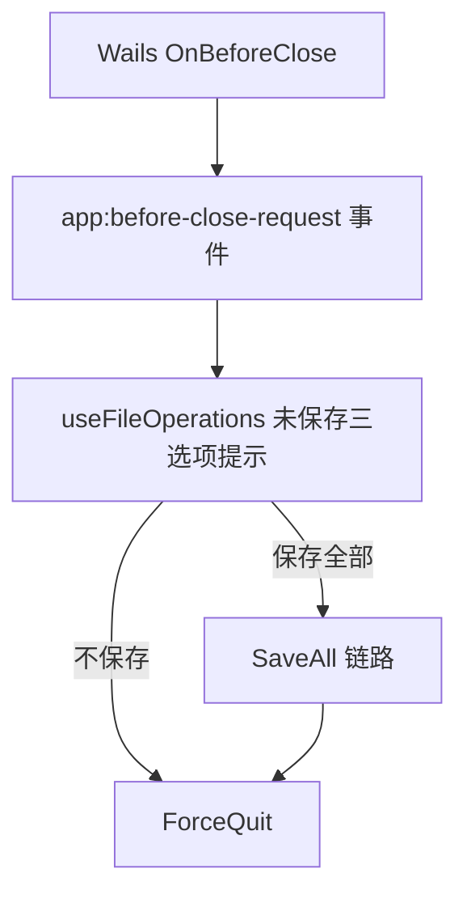

# 变更提案: unsaved-guard-and-animation-reload-prompts

## 元信息
```yaml
类型: 新功能
方案类型: implementation
优先级: P1
状态: 已确认
创建: 2026-03-18
```

---

## 1. 需求

### 背景
当前项目只有“切换模式前自动保存”的保护，缺少“切换数据文件前”和“关闭程序前”的统一未保存处理；同时弹道模式依赖 `Animations.json`，但动画数据变更需要有明确的回归保障，避免改动后静默失效。

### 目标
- 切换数据文件前，若存在未保存数据，弹出统一三选项提示：保存全部 / 不保存 / 取消。
- 关闭程序前，若存在未保存数据，弹出同样的三选项提示。
- 为弹道模式补齐动画数据变化命中的明确回归覆盖，确保 `Animations.json` 变化时会提示重新加载。
- 统一未保存提示语义，避免模式切换、数据切换、程序关闭三条链路行为分叉。

### 约束条件
```yaml
时间约束: 无
性能约束: 不增加长链阻塞；关闭拦截仅在存在脏数据时弹窗
兼容性约束: 保持现有 SaveAll、脚本保存、数据重载与 Wails 菜单事件链路兼容
业务约束: 保存策略按用户确认统一为“保存全部 / 不保存 / 取消”
```

### 验收标准
- [ ] 切换数据文件时，若有脏数据或脏脚本，会先弹出三选项提示。
- [ ] 关闭程序时，若有脏数据或脏脚本，会先弹出三选项提示；选择取消不会退出。
- [ ] 选择“保存全部”后会执行现有 SaveAll 链路，成功后继续切换/退出。
- [ ] 弹道模式下 `Animations.json` 外部变化命中逻辑有自动化回归覆盖，并保持重新加载确认行为。
- [ ] TypeScript、相关单测和前端 build 通过。

---

## 2. 方案

### 技术方案
实现分为三部分：
- 在 `InputDialog` 中增加通用三选项选择对话框，统一承载“保存全部 / 不保存 / 取消”。
- 在 `useFileOperations.ts` 中抽出统一的未保存保护入口，接入“模式切换”“数据切换”“程序关闭”三条链路。
- 在 Go/Wails 侧通过 `OnBeforeClose` 拦截关闭请求，转发到前端确认；前端处理完毕后调用后端放行退出。
- 为 `BaseDataReloadService` 补充弹道模式命中 `Animations.json` 的回归测试，锁定动画依赖行为。

### 影响范围
```yaml
涉及模块:
  - frontend/hooks: useFileOperations 增加统一未保存保护和关闭事件处理
  - frontend/components/common: InputDialog 增加三选项入口
  - frontend/services: BaseDataReloadService 补充回归测试
  - backend/app bootstrap: main.go/app.go 接入 OnBeforeClose 和放行退出方法
  - frontend/wailsjs: 更新新增后端方法绑定
预计变更文件: 7
```

### 风险评估
| 风险 | 等级 | 应对 |
|------|------|------|
| 关闭事件出现重复拦截或死循环 | 中 | 后端增加一次性放行标记，仅在确认后允许退出 |
| 三态提示接入后破坏现有模式切换 | 中 | 抽统一保护入口，模式切换和数据切换复用同一判断流程 |
| 弹道动画依赖逻辑被误判为新功能但其实已有 | 低 | 通过回归测试固定现有命中规则，避免未来回退 |

---

## 3. 技术设计（可选）

> 无数据模型变更；仅新增关闭拦截与前端确认协作。

### 架构设计


---

## 4. 核心场景

> 执行完成后同步到对应模块文档

### 场景: 切换数据文件前保护
**模块**: useFileOperations
**条件**: 当前存在脏数据文件或脏脚本
**行为**: 用户从菜单切换到另一份数据文件
**结果**: 先弹出“保存全部 / 不保存 / 取消”；仅在前两者选定后继续切换

### 场景: 关闭程序前保护
**模块**: Wails OnBeforeClose + useFileOperations
**条件**: 当前存在脏数据文件或脏脚本
**行为**: 用户点击窗口关闭或菜单退出
**结果**: 先弹出三选项提示；取消则阻止关闭，其余选项处理完毕后再真正退出

### 场景: 弹道模式动画依赖变化
**模块**: BaseDataReloadService
**条件**: 当前 UI 模式为 projectile
**行为**: `Animations.json` 发生外部变化
**结果**: 识别为依赖变化，触发重新加载确认

---

## 5. 技术决策

> 本方案涉及的技术决策，归档后成为决策的唯一完整记录

### unsaved-guard-and-animation-reload-prompts#D001: 未保存提示统一采用三选项并复用 SaveAll
**日期**: 2026-03-18
**状态**: ✅采纳
**背景**: 当前模式切换只会二态确认并自动保存，数据切换和程序关闭没有统一策略，行为不一致。
**选项分析**:
| 选项 | 优点 | 缺点 |
|------|------|------|
| A: 当前链路各自独立处理 | 改动局部小 | 交互不一致，后续更难维护 |
| B: 统一成“保存全部 / 不保存 / 取消” | 语义统一，可直接复用 SaveAll | 需要补三态对话框和关闭拦截 |
**决策**: 选择方案 B
**理由**: 与用户明确选择一致，也最适合桌面应用的全局退出和跨文件切换语义。
**影响**: 影响 InputDialog、useFileOperations、main.go/app.go 与前端 Wails 绑定

---

## 6. 成果设计

> 含视觉产出的任务由 DESIGN Phase2 填充。非视觉任务整节标注"N/A"。

N/A。本次为既有确认弹窗语义扩展，不新增新的视觉设计系统。
