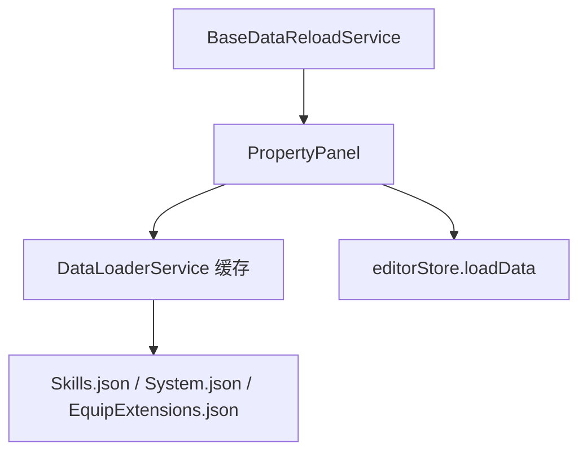

# 变更提案: property-weapon-attack-fields

## 元信息
```yaml
类型: 新功能
方案类型: implementation
优先级: P1
状态: 已确认
创建: 2026-03-18
```

---

## 1. 需求

### 背景
属性编辑模式当前只覆盖基础参数、浮动参数和武器装备类型。物品、武器、防具缺少统一的价格编辑入口，武器也无法直接配置攻击技能与攻击元素，导致这类字段仍需回到外部 JSON 手工修改，且武器属性面板对 `Skills.json` 的外部变化没有依赖刷新能力。

### 目标
- 在属性编辑模式下，为物品、武器、防具统一增加 `price` 数字输入框。
- 在武器数据下增加 `attackSkillId` 技能选择框，选项来自 `Skills.json`。
- 在武器数据下增加 `attackElementId` 元素选择框，选项来自 `System.json.elements`，保存时写入元素索引 ID。
- 补充属性/备注模式对武器依赖文件的监听，使 `Skills.json`、`System.json`、`EquipExtensions.json` 变化时触发重新加载确认并刷新选项。

### 约束条件
```yaml
时间约束: 本轮不处理“编辑器启动时自动写文件”问题，按用户要求显式排除。
性能约束: 继续复用现有缓存与事件刷新链路，不引入额外全量读取或轮询。
兼容性约束: 保持 `Items.json`、`Weapons.json`、`Armors.json` 现有保存链路不变；旧数据缺失新字段时按 0 回退。
业务约束: `attackElementId` 的 0 表示未选择元素；元素显示名来源必须与 `System.json.elements` 保持一致。
```

### 验收标准
- [ ] 属性模式编辑物品、武器、防具时都可编辑 `price`，保存后正确写回对应数据条目。
- [ ] 编辑武器时可从技能列表选择 `attackSkillId`，可从系统元素列表选择 `attackElementId`，保存后字段写回当前武器条目。
- [ ] 武器属性/备注模式下，`Skills.json`、`System.json`、`EquipExtensions.json` 外部变化会命中依赖重载确认；下拉选项刷新后可见最新技能与元素。

---

## 2. 方案

### 技术方案
- 扩展 `RPGItem` 类型，补充 `price`、`attackSkillId`、`attackElementId` 字段。
- 在 `PropertyPanel` 中增加文件类型判定与引用数据提取：
  - 物品/武器/防具共用 `price` 表单项；
  - 武器额外展示攻击技能和攻击元素选择框；
  - 技能选项从 `Skills.json` 缓存读取，元素选项从 `System.json` 兼容包装对象中提取 `elements`。
- 调整基础属性保存逻辑，把新字段与已有 `params/floatParams` 一起纳入变更检测和保存，避免只改扩展字段时被误判为“无变化”。
- 在 `BaseDataReloadService` 的属性模式依赖白名单中，为 `Weapons.json` 增加 `Skills.json`，延续已有 `System.json` 与 `EquipExtensions.json` 的确认链路。

### 影响范围
```yaml
涉及模块:
  - 属性面板: 扩展武器和通用品类的基础属性编辑项与保存逻辑
  - 数据重载服务: 扩展武器属性模式依赖文件集合
  - 类型定义: 为 RPG 数据模型补充新增字段
预计变更文件: 4
```

### 风险评估
| 风险 | 等级 | 应对 |
|------|------|------|
| `System.json` 采用 `[null, system]` 包装格式，元素读取路径取错会导致下拉为空 | 中 | 复用现有 `extractSystemRecord`/系统数据解析方式或兼容包装结构读取 |
| 武器新增字段保存后若未纳入变更检测，界面会提示“没有变化” | 中 | 将 `price/attackSkillId/attackElementId` 纳入统一基础属性保存比较 |
| 属性模式依赖白名单漏掉 `Skills.json` 会导致外部改技能后下拉不刷新 | 低 | 在 `BaseDataReloadService` 补回归测试，锁定武器属性模式依赖集合 |

---

## 3. 技术设计（可选）

> 涉及架构变更、API设计、数据模型变更时填写

### 架构设计


### 数据模型
| 字段 | 类型 | 说明 |
|------|------|------|
| `price` | `number` | 物品/武器/防具通用价格字段 |
| `attackSkillId` | `number` | 武器攻击时关联的技能 ID |
| `attackElementId` | `number` | 武器攻击时关联的元素 ID，来源为 `System.json.elements` 索引 |

---

## 4. 核心场景

> 执行完成后同步到对应模块文档

### 场景: 武器属性扩展编辑
**模块**: 属性面板
**条件**: 当前文件为 `Weapons.json`，当前模式为属性模式
**行为**: 用户编辑价格、攻击技能、攻击元素并保存
**结果**: 当前武器条目写回 `price`、`attackSkillId`、`attackElementId`，界面保持当前选中项并标记脏状态

### 场景: 外部依赖刷新
**模块**: 数据重载服务
**条件**: 当前文件为 `Weapons.json`，属性或备注模式已打开武器条目
**行为**: 工作区中的 `Skills.json`、`System.json` 或 `EquipExtensions.json` 被外部修改
**结果**: 编辑器弹出重新加载确认，确认后更新缓存并刷新武器属性引用数据

---

## 5. 技术决策

> 本方案涉及的技术决策，归档后成为决策的唯一完整记录

### property-weapon-attack-fields#D001: 复用现有属性面板与依赖重载链路扩展武器字段
**日期**: 2026-03-18
**状态**: ✅采纳
**背景**: 新字段需求集中在现有属性模式的单一面板内，同时还要求与当前外部数据变更确认链路保持一致。
**选项分析**:
| 选项 | 优点 | 缺点 |
|------|------|------|
| A: 在 `PropertyPanel` 与 `BaseDataReloadService` 上增量扩展 | 改动面小，复用现有保存与刷新链路，风险低 | 需小心处理武器专属字段与通用字段共存 |
| B: 为物品/武器/防具单独拆分新面板 | 结构更细 | 改动大，重复逻辑多，与当前模式架构不一致 |
**决策**: 选择方案 A
**理由**: 本次需求是现有属性模式的增量补全，不涉及架构重做；沿用现有面板和依赖判断可以最小成本完成并降低回归风险。
**影响**: `PropertyPanel.tsx`、`BaseDataReloadService.ts`、`types/index.ts` 及相关测试

---

## 6. 成果设计

> 含视觉产出的任务由 DESIGN Phase2 填充。非视觉任务整节标注"N/A"。

N/A。本次为现有属性面板的信息架构增量扩展，沿用项目既有视觉语言，不单独引入新的视觉设计方向。
