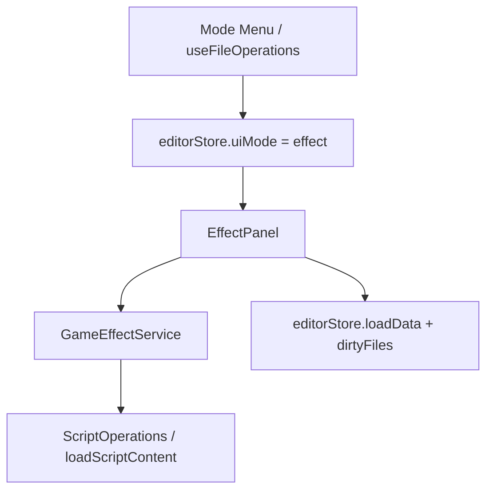

# 变更提案: effect-mode-and-script-dirty-sync

## 元信息
```yaml
类型: 新功能
方案类型: implementation
优先级: P1
状态: 已确认
创建: 2026-03-20
```

---

## 1. 需求

### 背景
当前编辑器已经有代码模式、属性模式、备注模式等，但还没有专门承载运行时效果配置的数据面板。与此同时，脚本模式虽然可以维护当前条目的脚本文件，但“新脚本保存后需要驱动当前数据条目脏标记”“脚本文件命名去掉时间戳”“从脚本导出函数里选择效果条件/执行函数”等链路都还没有打通。

### 目标
- 新增独立“效果模式”，仅覆盖当前脚本模式已支持的普通数据库条目。
- 进入效果模式时，若当前条目缺少 `gameEffects[]`，自动补空数组并把当前数据文件标记为脏。
- 每个效果项包含 `name`、`description`、`condition`、`execute`、`isStatic` 五个字段。
- `condition` 与 `execute` 从当前条目 `scripts` 中的脚本模块解析 ES Module 显式导出函数，保存结构为 `{ module, function }`。
- 新建/复制脚本文件名去掉时间戳；新脚本首次保存成功后，把当前数据文件标记为脏。

### 约束条件
```yaml
时间约束: 本轮只覆盖普通数据库条目，不扩展到任务、弹道、地图等专用数据结构。
性能约束: 脚本导出分析基于当前条目的脚本集合与现有缓存读取，不引入全项目脚本扫描。
兼容性约束: 导出函数只识别 ES Module 显式导出（export function / export const 等），不兼容 CommonJS。
业务约束: 效果模式必须是独立模式和独立面板，不合并进属性或备注模式。
```

### 验收标准
- [ ] 进入效果模式时，普通数据库条目缺少 `gameEffects` 会自动补成 `[]`，并把当前数据文件和条目标记为脏。
- [ ] 效果面板支持新增、删除、编辑效果项，并可保存 `name`、`description`、`condition`、`execute`、`isStatic`。
- [ ] `condition/execute` 的候选项来自当前条目脚本模块中的 ES Module 显式导出函数，保存值为 `{ module, function }`。
- [ ] 新建/复制脚本文件名不再包含时间戳；新脚本首次保存后，当前数据文件会进入脏状态。

---

## 2. 方案

### 技术方案
- 在类型层新增 `GameEffectActionRef`、`GameEffectEntry`，并把 `RPGItem` 扩展为可选 `gameEffects`。
- 新增 `GameEffectService`，统一处理：
  - 默认效果项结构创建；
  - `gameEffects` 自动补齐；
  - ES Module 显式导出函数解析；
  - 从当前条目脚本路径加载并汇总导出候选项。
- 新增独立 `EffectPanel`：
  - 进入模式时自动补齐 `gameEffects`；
  - 本地编辑效果项列表；
  - 保存时沿用 `loadData + markFileDirty + markItemDirty` 写回缓存与脏标记。
- 在 `EditorMode`、`MainContent`、`app.go`、`useFileOperations` 中接入 `effect` 模式。
- 在 `ScriptOperations` 中：
  - 去掉新建/复制脚本文件名中的 `Date.now()` 时间戳；
  - 新脚本首次保存成功后，将当前数据文件标记为脏。

### 影响范围
```yaml
涉及模块:
  - 脚本编辑链路: 新脚本保存后的数据脏标记、文件命名规则
  - 模式路由与主内容区: 新增 effect 模式入口与面板映射
  - 效果数据服务: 默认结构、脚本导出解析、候选项汇总
  - 数据模型: RPGItem 扩展 gameEffects 字段
预计变更文件: 9-12
```

### 风险评估
| 风险 | 等级 | 应对 |
|------|------|------|
| 脚本导出解析过宽或过窄会导致候选项遗漏/误识别 | 中 | 只支持明确的 ES Module 显式导出语法，并补充针对解析规则的单测 |
| 效果模式自动补齐 `gameEffects` 可能导致重复脏标记或选中项抖动 | 中 | 复用 NotePanel 的“缺字段即补齐”模式，确保仅缺失时写回一次 |
| 新脚本文件名去掉时间戳后，可能遇到同名文件冲突 | 低 | 仍以 `itemId + scriptKey` 生成确定性文件名，脚本键冲突在创建阶段拦截 |

---

## 3. 技术设计（可选）

> 涉及架构变更、API设计、数据模型变更时填写

### 架构设计


### 数据模型
| 字段 | 类型 | 说明 |
|------|------|------|
| `gameEffects` | `GameEffectEntry[]` | 当前普通数据库条目的效果配置集合 |
| `condition` | `{ module: string; function: string }` | 条件脚本引用，来自当前条目脚本模块的导出函数 |
| `execute` | `{ module: string; function: string }` | 执行脚本引用，来自当前条目脚本模块的导出函数 |
| `isStatic` | `boolean` | 标记该效果是静态缓存还是动态计算 |

---

## 4. 核心场景

> 执行完成后同步到对应模块文档

### 场景: 首次进入效果模式
**模块**: EffectPanel
**条件**: 当前加载的是普通数据库条目，且该条目没有 `gameEffects`
**行为**: 用户切换到效果模式
**结果**: 当前条目自动补齐 `gameEffects: []`，当前数据文件与条目被标记为脏

### 场景: 从脚本导出中选择效果行为
**模块**: GameEffectService / EffectPanel
**条件**: 当前条目存在一个或多个脚本模块，且脚本中存在 ES Module 显式导出函数
**行为**: 用户在效果项中选择 condition / execute
**结果**: UI 展示模块.函数候选项，保存时写入 `{ module, function }`

---

## 5. 技术决策

> 本方案涉及的技术决策，归档后成为决策的唯一完整记录

### effect-mode-and-script-dirty-sync#D001: 效果能力采用独立模式与独立服务接入
**日期**: 2026-03-20
**状态**: ✅采纳
**背景**: 需求明确要求“效果模式”，同时效果项依赖脚本导出解析与 `gameEffects` 数据补齐，不适合继续塞进属性或备注面板。
**选项分析**:
| 选项 | 优点 | 缺点 |
|------|------|------|
| A: 独立 `EffectPanel` + `GameEffectService` | 模式语义清晰，后续扩展字段和校验最稳，和需求完全一致 | 接入点较多 |
| B: 复用 PropertyPanel 扩展效果卡片 | 改动表面较少 | 背离“效果模式”，职责继续膨胀 |
**决策**: 选择方案 A
**理由**: 效果配置有独立的数据结构与脚本导出依赖，抽成独立模式与独立服务最利于后续演进，也避免继续扩大 PropertyPanel 的复杂度。
**影响**: `types/index.ts`、`MainContent.tsx`、`app.go`、`useFileOperations.ts`、`ScriptOperations.ts` 以及新增 `EffectPanel/GameEffectService`

---

## 6. 成果设计

> 含视觉产出的任务由 DESIGN Phase2 填充。非视觉任务整节标注"N/A"。

N/A。本次为现有编辑器模式与数据结构扩展，沿用既有面板视觉系统，不额外引入新的视觉方向。
