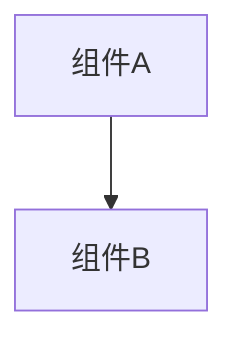

# 变更提案: effect-module-config-migration

## 元信息
```yaml
类型: 重构
方案类型: implementation
优先级: P1
状态: 已确认
创建: 2026-03-20
```

---

## 1. 需求

### 背景
当前效果模式把效果项建模为 `condition/execute` 函数引用，并通过解析脚本导出生成候选项。这与新的运行时约定不一致：运行时只关心当前条目 `scripts` 里的脚本键名，效果项需要保存 `module + config`，且编辑器不应扫描或生成 `effects/` 目录内容。

### 目标
- 将 `gameEffects` 结构改为 `name/description/module/isStatic/config`
- 进入效果模式时，发现旧字段 `condition/execute` 直接删除并迁移到 `module`，同时把当前数据文件标记为脏
- 效果面板只基于当前条目 `scripts` 的键名生成 `module` 下拉，不再读取脚本文件内容
- 脚本重命名/删除时同步 `gameEffects.module` 引用；删除时弹窗告知受影响效果项，便于用户检查

### 约束条件
```yaml
时间约束: 无
性能约束: 不读取脚本文件内容，不扫描 effects/ 目录
兼容性约束: 不做兼容层；旧字段 condition/execute 发现后直接删除
业务约束: gameEffects[*].module 保存 scriptName，config 只做 JSON 保存与校验，不做业务解释
```

### 验收标准
- [ ] 普通数据库条目进入效果模式时仍会自动补齐 `gameEffects`
- [ ] 效果项 UI 不再出现 `condition/execute`，只编辑 `name/description/module/isStatic/config`
- [ ] `module` 下拉只显示当前条目 `scripts` 的键名，保存值为字符串 scriptName
- [ ] 旧数据中 `condition/execute` 会被迁移并删除，迁移后当前数据文件与条目标记为脏
- [ ] 脚本重命名/删除时，`gameEffects.module` 不会失联；删除时会提示受影响项

---

## 2. 方案

### 技术方案
保留现有效果模式入口，只重写数据模型和面板交互。`GameEffectService` 改为负责旧字段迁移、默认值补齐、脚本键名候选生成与脚本引用联动；`EffectPanel` 改为使用字符串 `module` 选择和原始 JSON `config` 编辑框。脚本操作层在重命名/删除脚本时同步更新当前条目 `gameEffects.module`，删除前收集受影响效果名并弹窗提示。

### 影响范围
```yaml
涉及模块:
  - 前后端交互与性能修复记录: 效果模式 UI、脚本删除/重命名交互提示
  - 数据加载与地图管理: gameEffects 自动迁移与脏标记规则
预计变更文件: 7
```

### 风险评估
| 风险 | 等级 | 应对 |
|------|------|------|
| 旧字段迁移后数据丢失用户期望信息 | 中 | 仅从 `condition.module/execute.module` 提取 `module`，其他旧字段明确删除并标脏 |
| `config` JSON 文本输入导致保存失败 | 中 | 保存前 `JSON.parse`，失败即阻止保存并给出明确提示 |
| 脚本删除时效果引用失联 | 中 | 删除前提示受影响效果项，删除后清空 `module` 并标脏 |

---

## 3. 技术设计（可选）

> 涉及架构变更、API设计、数据模型变更时填写

### 架构设计


### API设计
#### {METHOD} {路径}
- **请求**: {结构}
- **响应**: {结构}

### 数据模型
| 字段 | 类型 | 说明 |
|------|------|------|
| gameEffects[].name | string | 效果名称 |
| gameEffects[].description | string | 效果描述 |
| gameEffects[].module | string | 当前条目 `scripts` 的 scriptName |
| gameEffects[].isStatic | boolean | 是否静态缓存 |
| gameEffects[].config | Record<string, unknown> | 模块私有配置，编辑器仅存取 JSON |

---

## 4. 核心场景

> 执行完成后同步到对应模块文档

### 场景: 旧效果数据迁移
**模块**: 数据加载与地图管理
**条件**: 当前普通数据库条目存在旧版 `gameEffects.condition/execute`
**行为**: 进入效果模式时执行迁移，提取旧 `module`，删除旧字段并补齐 `config`
**结果**: 当前条目被更新为新结构，当前数据文件和条目标记为脏

### 场景: 脚本删除影响效果引用
**模块**: 前后端交互与性能修复记录
**条件**: 当前条目的某个效果项 `module` 引用了将被删除的脚本键
**行为**: 删除脚本前弹窗展示受影响效果项；确认后删除脚本并清空对应 `module`
**结果**: 效果引用不再悬空，用户知道哪些效果需要回看配置

---

## 5. 技术决策

> 本方案涉及的技术决策，归档后成为决策的唯一完整记录

### effect-module-config-migration#D001: 效果模式改为 scriptName + config 结构
**日期**: 2026-03-20
**状态**: ✅采纳
**背景**: 新运行时不再按导出函数调用效果，而是按当前条目脚本键名加载模块，并由模块内部读取配置对象。
**选项分析**:
| 选项 | 优点 | 缺点 |
|------|------|------|
| A: 保留 `condition/execute` + 导出解析 | 继续复用当前实现 | 与最新需求和运行时模型不一致，面板复杂度高 |
| B: 改为 `module + config`，候选直接取 `scripts` 键名 | 与运行时一致，迁移后结构更简单，面板职责更清晰 | 需要一次性迁移旧字段并补脚本联动 |
**决策**: 选择方案B
**理由**: 需求已经明确运行时只关心 scriptName，继续保留导出解析和 `condition/execute` 只会制造额外状态与兼容负担。
**影响**: `types`、`GameEffectService`、`EffectPanel`、`ScriptOperations`、效果模式知识库文档与测试

---

## 6. 成果设计

> 含视觉产出的任务由 DESIGN Phase2 填充。非视觉任务整节标注"N/A"。

N/A
