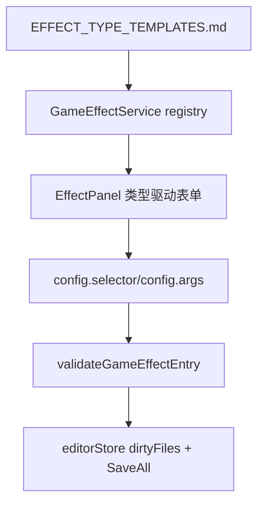

# 变更提案: effect-type-form-editor-sync

## 元信息
```yaml
类型: 重构
方案类型: implementation
优先级: P1
状态: 已确认
创建: 2026-03-22
```

---

## 1. 需求

### 背景
`D:\RMProjects\MyGame\effects\EFFECT_TYPE_TEMPLATES.md` 已再次更新。当前编辑器虽然已经接入 `effectType` registry，但仍以 JSON 文本框为主，不满足新版文档要求的“类型驱动表单”：
- 新增多种 owner/cunit/engine 模板；
- 需要按 `effectType` 决定 `selector` 是否显示、`args` 暴露哪些字段；
- `custom_script_effect` 不能再自动继承共享模板默认字段；
- 编辑器不应继续允许用户随意编辑未注册字段。

### 目标
- 同步 `GameEffectType` 和默认模板注册表到新版文档。
- 重构 `GameEffectService`，让模板定义显式表达 `selectorMode/argsMode/默认模板/字段约束`。
- 把 `EffectPanel` 从 JSON 主编辑改成类型驱动表单，只暴露文档允许的字段。
- 保存前统一按模板约束校验，旧字段清理后继续标记当前数据为脏。

### 约束条件
```yaml
时间约束: 当前轮次内完成代码、验证和知识库同步
性能约束: 仅编辑器侧改动，不引入新的运行时依赖或高频复杂计算
兼容性约束: 不做兼容层；旧字段和旧模板类型进入效果模式后直接清理/收敛并标脏
业务约束: custom_script_effect 继续保留脚本模块选择能力，但不能自动带共享模板字段
```

### 验收标准
- [ ] `GameEffectType` 与默认模板集合同步到新文档，新增 owner/cunit/engine 相关模板
- [ ] `EffectPanel` 按类型驱动显示字段，不能再自由输入未注册 selector/args 字段
- [ ] `custom_script_effect` 默认只给空 `selector/args` 壳子，并继续支持当前条目脚本模块选择
- [ ] `bunx tsc --noEmit`、`bun run test --run src/services/GameEffectService.test.ts`、`bun run build` 通过

---

## 2. 方案

### 技术方案
以 `GameEffectService` 作为单一模板事实源，新增模板元数据来描述：
- 默认 `module/isStatic`
- `selectorMode` 与 `argsMode`
- 允许的 selector 字段和 args 字段
- 完整默认示例

`EffectPanel` 不再直接暴露整块 `config JSON`，而是改成：
- 公共字段：`name/description/effectType/module/isStatic`
- 条件字段面板：按 `selectorMode` 决定是否显示，字段按模板白名单渲染
- 参数字段面板：按 `argsMode` 渲染 `ops/requiredCount/requiredMetaKeys/value`
- `custom_script_effect` 仅显示自定义脚本所需的最小字段面板

保存时由面板表单值重新组装成标准 `config = { selector, args }`，再交由 `validateGameEffectEntry()` 做最终约束校验。

### 影响范围
```yaml
涉及模块:
  - frontend-interaction-and-performance: 效果面板交互从 JSON 编辑转为类型驱动表单
  - data-loading-and-map-management: effectType 归一化与旧字段清理规则更新
预计变更文件: 8-10
```

### 风险评估
| 风险 | 等级 | 应对 |
|------|------|------|
| 表单化后默认值与运行时模板不一致 | 中 | 以新文档为准统一收口 registry，并补完整示例测试 |
| 旧效果数据进入面板后被过度清理 | 中 | 在 service 中显式区分共享模板与 custom 模板的白名单和清理逻辑 |
| 面板状态与保存 payload 不一致 | 中 | 由 service 统一构造默认 selector/args，并用测试覆盖主要模板 |

---

## 3. 技术设计（可选）

> 涉及架构变更、API设计、数据模型变更时填写

### 架构设计


### API设计
#### {METHOD} {路径}
- **请求**: {结构}
- **响应**: {结构}

### 数据模型
| 字段 | 类型 | 说明 |
|------|------|------|
| effectType | `GameEffectType` | 效果模板类型 |
| selectorMode | `'none' \| 'equip' \| 'custom'` | 控制是否显示 selector 面板 |
| argsMode | `'ops' \| 'count+ops' \| 'meta+ops' \| 'custom'` | 控制 args 表单字段 |
| config.selector | `Record<string, unknown>` | 由类型驱动生成和保存 |
| config.args | `Record<string, unknown>` | 由类型驱动生成和保存 |

---

## 4. 核心场景

> 执行完成后同步到对应模块文档

### 场景: {场景名称}
**模块**: EffectPanel / GameEffectService
**条件**: 用户进入普通数据库条目的效果模式并新建或编辑效果
**行为**: 先选择 `effectType`，面板按模板决定是否展示 selector 和具体 args 字段，保存时重组标准 `config`
**结果**: 数据只保留模板允许字段，且 `custom_script_effect` 不会混入共享模板字段

---

## 5. 技术决策

> 本方案涉及的技术决策，归档后成为决策的唯一完整记录

### effect-type-form-editor-sync#D001: 效果编辑器改为类型驱动表单而不是继续保留 JSON 主编辑
**日期**: 2026-03-22
**状态**: ✅采纳
**背景**: 新版模板文档已经明确要求编辑器按 `effectType` 约束字段，当前 JSON 文本编辑无法防止用户录入无效字段，也无法按模板隐藏无意义的 selector 面板。
**选项分析**:
| 选项 | 优点 | 缺点 |
|------|------|------|
| A: 保留 JSON 编辑，仅同步模板与校验 | 变更小，开发快 | 不满足新文档目标，仍会暴露无效字段 |
| B: 改为类型驱动表单 | 能按模板隐藏/约束字段，和运行时模板更一致 | 面板实现复杂度更高 |
**决策**: 选择方案B
**理由**: 这次需求的核心就是“编辑器不要再无差别暴露字段”，继续保留 JSON 主编辑会直接违背文档。
**影响**: `frontend/src/services/GameEffectService.ts`、`frontend/src/components/panels/EffectPanel.tsx`、测试与知识库文档

---

## 6. 成果设计

> 含视觉产出的任务由 DESIGN Phase2 填充。非视觉任务整节标注"N/A"。

### 设计方向
- **美学基调**: N/A
- **记忆点**: N/A
- **参考**: 无

### 视觉要素
- **配色**: N/A
- **字体**: N/A
- **布局**: 在现有效果面板结构内做字段表单化，不重做视觉风格
- **动效**: N/A
- **氛围**: N/A

### 技术约束
- **可访问性**: N/A
- **响应式**: 继续兼容现有效果面板的桌面与窄屏滚动布局
