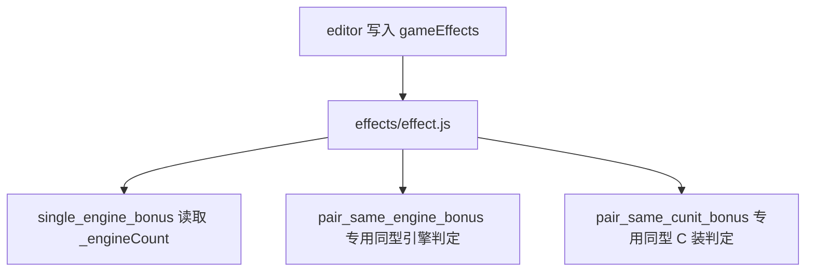

# 变更提案: effect-runtime-count-sync

## 元信息
```yaml
类型: 重构
方案类型: implementation
优先级: P1
状态: 已确认
创建: 2026-03-22
```

---

## 1. 需求

### 背景
编辑器已经会按新版模板输出 `single_engine_bonus / pair_same_engine_bonus / pair_same_cunit_bonus / cunit_owner_stat_bonus / cunit_slot_action_repeat_bonus` 等效果数据，但运行时 `D:\RMProjects\MyGame\effects\effect.js` 仍保留了过于泛化的 `countByEquipType(owner, equipTypeId)` 计数逻辑。当前项目运行时本身已经维护了 `_engineCount`，且引擎/C 装双同型判定也分别有专属类型语义，继续保留泛型计数函数会让新模板分支显得冗余。

### 目标
- 收紧 `effect.js` 中 owner/engine/cunit 相关模板分支的计数逻辑。
- `single_engine_bonus` 直接复用现有引擎计数能力，而不是再扫描 `_equipObjects`。
- 保留引擎/C 装双同型判定的专用扫描语义，不再为它们暴露无意义的泛型 `countByEquipType()`。
- 确认编辑器已经写出的 `single_engine_bonus` 数据可以被当前运行时分支正确消费。

### 约束条件
```yaml
时间约束: 当前轮次内完成运行时代码修改与基础验证
性能约束: 不引入新的高频数组复制或额外缓存分配
兼容性约束: 不新增旧协议兼容分支，按当前 effectType 协议收口
业务约束: 引擎和 C 装模板都按各自现有业务语义实现，不把计数逻辑重新抽象回泛型层
```

### 验收标准
- [ ] `single_engine_bonus` 不再通过泛型 `countByEquipType()` 判断引擎数量
- [ ] 引擎/C 装相关模板分支改为复用现有专用计数/类型逻辑，`countByEquipType()` 被删除或不再作为公开主路径
- [ ] 运行时代码语法检查通过，并且能解释用户给出的 `single_engine_bonus` 示例数据为何可命中

---

## 2. 方案

### 技术方案
聚焦修改 `D:\RMProjects\MyGame\effects\effect.js`：
- 删除或内联 `countByEquipType(owner, equipTypeId)`；
- 新增更贴近业务语义的专用辅助函数，例如引擎数量读取、按类型做同基础 id 判定；
- `single_engine_bonus` 直接改为读取 `ctx.owner._engineCount`；
- `pair_same_engine_bonus / pair_same_cunit_bonus` 继续走按类型扫描的同基础 id 判定，但命名收口成“engine/cunit 专用”语义；
- 其余 owner/cunit 模板只保留必要分支，不再依赖泛型数量函数。

### 影响范围
```yaml
涉及模块:
  - 运行时效果分派: `effect.js` 中 owner/engine/cunit 模板逻辑收口
预计变更文件: 1-3
```

### 风险评估
| 风险 | 等级 | 应对 |
|------|------|------|
| 误判现有引擎数量语义 | 中 | 直接复用 `owner._engineCount`，不自行重新定义引擎计数规则 |
| C 装分支被错误收口成引擎同路径 | 中 | 引擎和 C 装分别保留专属 helper 名称与条件分支 |
| 运行时缺少自动化测试 | 中 | 至少执行语法检查，并在结果里明确手动验证路径 |

---

## 3. 技术设计（可选）

> 涉及架构变更、API设计、数据模型变更时填写

### 架构设计


### API设计
#### {METHOD} {路径}
- **请求**: {结构}
- **响应**: {结构}

### 数据模型
| 字段 | 类型 | 说明 |
|------|------|------|
| effectType | `string` | 运行时模板分派键 |
| args.ops | `number[][]` | 运行时属性操作数组 |
| owner._engineCount | `number` | 当前 owner 已装备引擎数量缓存 |

---

## 4. 核心场景

> 执行完成后同步到对应模块文档

### 场景: 单引擎奖励生效
**模块**: `D:\RMProjects\MyGame\effects\effect.js`
**条件**: owner 当前仅装备一个引擎，且效果数据为 `single_engine_bonus`
**行为**: 运行时读取 `_engineCount === 1` 后，对 owner 应用 `args.ops`
**结果**: 你贴出的 `ops: [[101, 1, 3000]]` 会直接累计到 owner 载重链

---

## 5. 技术决策

> 本方案涉及的技术决策，归档后成为决策的唯一完整记录

### effect-runtime-count-sync#D001: 运行时按业务语义收口引擎/C 装计数，而不是保留泛型计数函数
**日期**: 2026-03-22
**状态**: ✅采纳
**背景**: 当前 `effect.js` 里的 `countByEquipType(owner, equipTypeId)` 看似复用，实际只给 `single_engine_bonus` 用了一次，而运行时已经有 `_engineCount`。继续保留它会让新模板分支的语义变散。
**选项分析**:
| 选项 | 优点 | 缺点 |
|------|------|------|
| A: 保留泛型计数函数 | 改动小 | 语义模糊，没利用已有 `_engineCount` |
| B: 改为引擎/C 装专用计数语义 | 分支语义清晰，和现有运行时缓存一致 | 需要重命名/收口 helper |
**决策**: 选择方案B
**理由**: 用户明确要求引擎和 C 装按现成计数能力收口；这比继续挂一个泛型函数更符合当前运行时结构。
**影响**: `D:\RMProjects\MyGame\effects\effect.js`，以及相关运行时效果模板的手动验证路径

---

## 6. 成果设计

> 含视觉产出的任务由 DESIGN Phase2 填充。非视觉任务整节标注"N/A"。

### 设计方向
- **美学基调**: N/A
- **记忆点**: N/A
- **参考**: 无

### 视觉要素
- **配色**: N/A
- **字体**: N/A
- **布局**: N/A
- **动效**: N/A
- **氛围**: N/A

### 技术约束
- **可访问性**: N/A
- **响应式**: N/A
