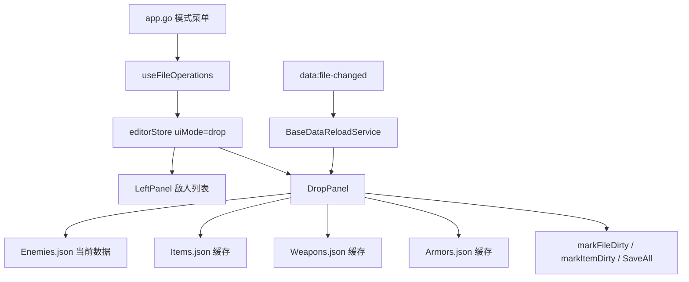

# 变更提案: drop-mode-enemy-drops

## 元信息
```yaml
类型: 新功能
方案类型: implementation
优先级: P1
状态: 草稿
创建: 2026-03-24
```

---

## 1. 需求

### 背景
当前编辑器已经有属性、备注、任务、弹道、装备、效果等专用模式，但敌人掉落仍缺少结构化编辑入口。现有需求希望新增“掉落模式”，以 `Enemies.json` 为主文件直接维护敌人的掉落配置，并联动物品、武器、防具三类基础数据库。

### 目标
- 新增 `drop` 模式，并以 `Enemies.json` 为主数据源展示敌人列表和掉落配置。
- 掉落面板同时读取 `Items.json`、`Weapons.json`、`Armors.json` 作为引用源。
- 每个敌人的掉落字段统一为 `enemyDrops`，结构为 `Array<{ dropType, dropId, dropChance }>`。
- 若当前选中的敌人不存在 `enemyDrops`，进入编辑态时自动初始化为空数组并标记当前敌人及 `Enemies.json` 为脏。
- `dropType` 的展示文案固定为“物品 / 武器 / 防具”，其持久化值固定为 `0 / 1 / 2`。

### 约束条件
```yaml
时间约束: 本轮直接进入实现与验证
性能约束:
  - 不新增新的全量预载策略
  - 继续复用当前基础数据库缓存
兼容性约束:
  - 不破坏现有 property/note/quest/projectile/equip/effect/map 模式
  - 保存链路必须兼容现有 dirtyFiles + SaveAll 体系
业务约束:
  - 左侧在 drop 模式下只能呈现敌人列表
  - 掉落数据直接写回 Enemies.json，不新增独立扩展文件
  - 缺失 enemyDrops 只在“选中当前敌人”时初始化，不做全表批量补齐
  - 被引用项缺失时保留 dropId，并在界面中显示失效状态
```

### 验收标准
- [ ] 菜单和主内容区支持切换到 `drop` 模式，必要时自动切到 `Enemies.json`。
- [ ] 左侧在 `drop` 模式下仅显示敌人列表，并沿用 `Enemies.json` 的脏标记。
- [ ] 当前敌人缺失 `enemyDrops` 时，选中后自动创建空数组并标脏。
- [ ] 掉落项支持新增、删除、修改 `dropType / dropId / dropChance`，其中 `dropChance` 支持 `0-100` 小数。
- [ ] `Items.json`、`Weapons.json`、`Armors.json`、`Enemies.json` 外部变化命中掉落模式时，能走统一依赖重载确认。

---

## 2. 方案

### 技术方案
本次采用“`Enemies.json` 主文件 + `drop` 专用 UI 模式”的方案，而不是引入新的 `fileType` 或独立聚合文件。这样可以复用当前模式切换、缓存、脏标记、保存和外部变更监听链路，侵入最小。

实现分四层推进：
- 模式层：扩展 `EditorMode`，在 `app.go`、`useFileOperations`、`MainContent` 中接入 `drop` 模式。
- 列表层：复用当前左侧列表组件，但在 `drop` 模式下固定标题为“敌人列表”，并保持主文件为 `Enemies.json`。
- 面板层：新增 `DropPanel`，读取当前敌人及三类引用数据，提供掉落项行编辑。
- 联动层：在 `BaseDataReloadService` 中增加 `drop` 模式依赖白名单，并补对应测试，确保依赖文件变化能刷新当前面板。

### 影响范围
```yaml
涉及模块:
  - app.go: 模式菜单新增“掉落模式”入口
  - frontend/src/types/index.ts: 扩展 drop 模式与敌人掉落相关类型
  - frontend/src/stores/editorStore.ts: 保持 drop 模式与普通数据文件切换的模式恢复逻辑
  - frontend/src/hooks/useFileOperations.ts: 掉落模式切换、依赖文件预备与当前文件守卫
  - frontend/src/components/layout/MainContent.tsx: 渲染 DropPanel
  - frontend/src/components/layout/LeftPanel.tsx: drop 模式标题与列表语义调整
  - frontend/src/components/panels/DropPanel.tsx: 新增掉落模式核心面板
  - frontend/src/services/BaseDataReloadService.ts: 掉落模式依赖命中规则
  - frontend/src/services/BaseDataReloadService.test.ts: 掉落模式依赖刷新测试
预计变更文件: 8-10
```

### 风险评估
| 风险 | 等级 | 应对 |
|------|------|------|
| `Enemies.json` 当前类型未显式声明 `enemyDrops`，直接实现可能产生弱类型回归 | 中 | 在 `types/index.ts` 中补最小必要的敌人与掉落结构类型 |
| 当前敌人进入编辑态即初始化空数组，会导致“仅浏览也标脏” | 中 | 明确只对当前选中敌人生效，不做全量补齐，并在摘要区说明原因 |
| 引用项被删除后若直接清空 `dropId`，会丢失真实数据 | 中 | 保留原始 `dropId`，在候选项中注入“已失效 #id”占位 |
| 掉落模式若不接入依赖白名单，外部改动后会显示旧候选项 | 中 | 在 `BaseDataReloadService` 和对应测试中明确增加 `Items/Weapons/Armors/Enemies` 依赖集合 |

---

## 3. 技术设计

### 架构设计


### 数据模型
| 字段 | 类型 | 说明 |
|------|------|------|
| `EditorMode.drop` | string literal | 新增掉落模式 |
| `enemy.enemyDrops` | `EnemyDropEntry[]` | 敌人的掉落数组 |
| `EnemyDropEntry.dropType` | `0 \| 1 \| 2` | 掉落类型，0=物品，1=武器，2=防具 |
| `EnemyDropEntry.dropId` | `number` | 掉落目标条目 ID |
| `EnemyDropEntry.dropChance` | `number` | 掉落概率，范围 0-100，允许小数 |

### 候选项与初始化规则
- `dropType = 0` 时候选项来自 `Items.json`。
- `dropType = 1` 时候选项来自 `Weapons.json`。
- `dropType = 2` 时候选项来自 `Armors.json`。
- 掉落项始终保留一个 `0 : 未选择` 占位。
- 若当前 `dropId` 在目标数据源中不存在，则在候选项头部注入 `"{dropId} : 已失效引用"` 以保留原数据可见性。
- 当前敌人缺失 `enemyDrops` 时，进入该敌人编辑态后立即补为 `[]`，并通过现有 `markFileDirty + markItemDirty` 链路标脏。

### UI 分区
- 左侧：敌人列表，继续复用通用虚拟列表。
- 右侧：
  - 顶部摘要区：显示当前敌人名、掉落条目数、当前敌人是否已修改。
  - 掉落条目编辑区：每行编辑 `dropType / dropId / dropChance`。
  - 操作区：新增一行、删除一行。

---

## 4. 核心场景

### 场景: 切换到掉落模式编辑敌人掉落
**模块**: DropPanel / useFileOperations  
**条件**: 当前工作区已打开  
**行为**: 用户切换到 `drop` 模式  
**结果**: 若当前不是 `Enemies.json`，系统自动切到敌人数据，并展示敌人列表与掉落编辑面板

### 场景: 首次编辑没有 enemyDrops 的敌人
**模块**: DropPanel  
**条件**: 当前敌人对象不存在 `enemyDrops` 字段  
**行为**: 用户在左侧选中该敌人  
**结果**: 当前敌人被补齐 `enemyDrops: []`，并将当前敌人与 `Enemies.json` 标记为脏

### 场景: 切换掉落类型后联动引用数据源
**模块**: DropPanel  
**条件**: 当前敌人至少存在一条掉落项  
**行为**: 用户修改某条掉落项的 `dropType`  
**结果**: `dropId` 候选列表立即切换到对应的物品、武器或防具数据源

### 场景: 引用数据外部变化
**模块**: BaseDataReloadService / useFileOperations  
**条件**: 当前激活面板为 `drop`  
**行为**: 外部修改 `Items.json`、`Weapons.json`、`Armors.json` 或 `Enemies.json`  
**结果**: 系统按命中规则静默刷新缓存或弹确认框，确认后刷新当前掉落面板

---

## 5. 技术决策

### drop-mode-enemy-drops#D001: 掉落模式采用 Enemies 主文件而不是独立聚合 fileType
**日期**: 2026-03-24  
**状态**: ✅采纳  
**背景**: 掉落编辑依赖四份数据，但最终持久化目标仅为 `Enemies.json`。需要在实现成本和后续维护之间平衡。  
**选项分析**:
| 选项 | 优点 | 缺点 |
|------|------|------|
| A: `Enemies.json` 主文件 + `drop` uiMode | 侵入小、保存链路自然、兼容现有缓存与 SaveAll | 不是独立文件域，后续批量工作台扩展受限 |
| B: 独立 `drop fileType` / 聚合模式 | 领域抽象完整，便于未来做批量掉落工作台 | 需要引入伪文件保存语义，监听与脏标记更复杂 |
**决策**: 选择方案 A  
**理由**: 当前目标是把敌人掉落编辑快速纳入现有体系，不引入新的物理文件或伪文件抽象。  
**影响**: `app.go`、`useFileOperations`、`MainContent`、`LeftPanel`、`DropPanel`

### drop-mode-enemy-drops#D002: 缺失 enemyDrops 仅在选中当前敌人时初始化
**日期**: 2026-03-24  
**状态**: ✅采纳  
**背景**: 用户要求缺失字段时自动补齐并标脏，但若全表批量补齐，会让单纯浏览也造成大量脏数据。  
**选项分析**:
| 选项 | 优点 | 缺点 |
|------|------|------|
| A: 进入模式时批量补齐所有敌人 | 数据结构一次性完整 | 会导致整表被动标脏，噪音太大 |
| B: 仅在选中当前敌人时初始化 | 改动范围最小，符合交互直觉 | 浏览某个敌人也会产生脏标记 |
**决策**: 选择方案 B  
**理由**: 既满足“无字段则创建并标脏”，又把影响范围控制在用户实际进入编辑态的敌人上。  
**影响**: `DropPanel` 初始化逻辑、脏标记提示文案

---

## 6. 成果设计

### 设计方向
- **美学基调**: N/A，沿用现有编辑器的赛博工业面板语言，不引入新的视觉主题
- **记忆点**: N/A
- **参考**: 现有 `EquipPanel` / `QuestPanel` 的分区卡片结构

### 视觉要素
- **配色**: 复用现有主题变量和面板底色，不新增主题色
- **字体**: 复用现有全局字体栈
- **布局**: 延续“顶部摘要 + 主编辑区”的编辑器面板结构
- **动效**: N/A
- **氛围**: 保持现有编辑器风格一致性

### 技术约束
- **可访问性**: 保持已有表单语义和可点击控件层级
- **响应式**: 维持现有面板在桌面宽度下的分区布局，窄宽度下允许自然换行
