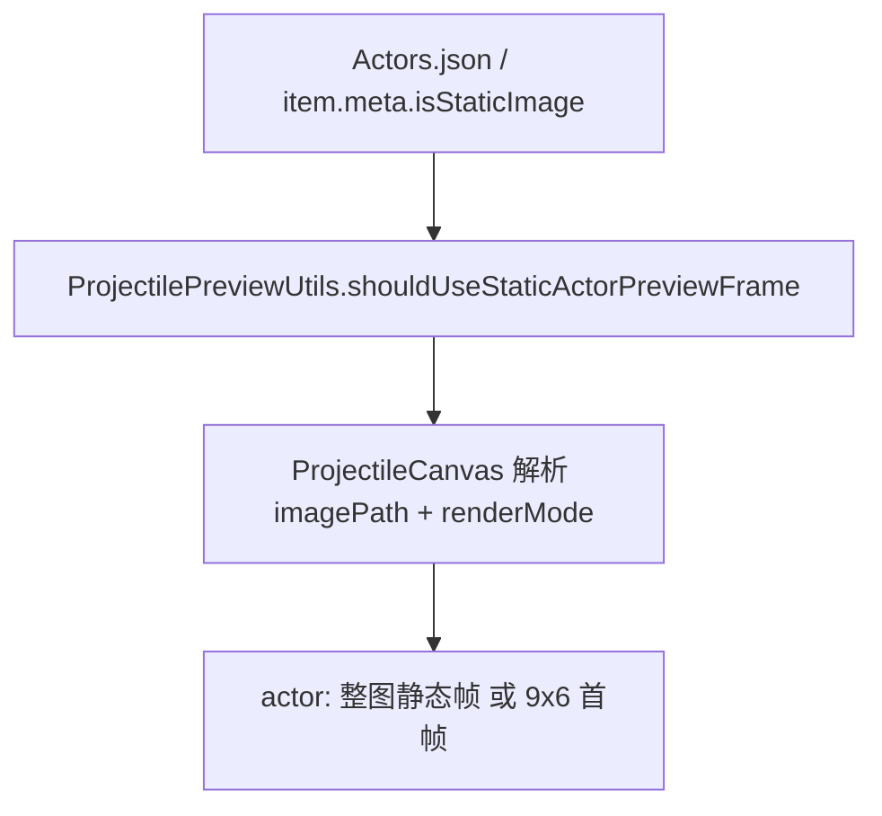

# 变更提案: projectile-preview-static-battler-frame

## 元信息
```yaml
类型: 修复
方案类型: implementation
优先级: P1
状态: 已确认
创建: 2026-03-31
```

---

## 1. 需求

### 背景
当前编辑器的弹道预览会把所有 actor 一律按 `sv_actors` 的 9x6 动态图处理，并裁左上第一帧作为待机帧。这个口径已经落后于项目运行时：部分战车会通过 `meta.isStaticImage` 改为静态帧表现，导致编辑器预览与游戏内实际显示不一致。

### 目标
- 弹道预览复用运行时 `meta.isStaticImage` 口径，不新增编辑器专用开关。
- actor 在 `meta.isStaticImage=true` 时改为直接使用整张静态帧；未开启时继续按 9x6 动态图裁第一帧。
- 保持敌人整图预览、朝向、站位与现有弹道计算逻辑不变。

### 约束条件
```yaml
时间约束: 无
性能约束: 继续复用 Pixi 预览精灵和纹理缓存，不引入重复销毁重建
兼容性约束: 未设置 meta.isStaticImage 的 actor 继续走现有 9x6 首帧逻辑；enemy 继续整图逻辑
业务约束: 直接复用 meta.isStaticImage，不允许新增编辑器本地预览开关
```

### 验收标准
- [ ] actor 的弹道预览会根据 `meta.isStaticImage` 在“9x6 首帧”和“整张静态帧”之间切换
- [ ] 敌人预览、朝向、站位、弹道起终点和偏移链不回归
- [ ] 对应静态帧判断有纯函数测试覆盖，防止后续再次回退为固定动态首帧

---

## 2. 方案

### 技术方案
将 actor 的静态帧判断抽到 `ProjectilePreviewUtils`，统一通过 `shouldUseStaticActorPreviewFrame()` 读取条目 `meta.isStaticImage`。  
`ProjectileCanvas` 的 battler 预览加载链改成两步：
- 先解析 `imagePath + useStaticFrame`
- 再根据 `useStaticFrame` 决定 actor 是直接加载整张纹理，还是裁 9x6 的左上第一帧

同时把纹理缓存 key 从单纯的 `type + imagePath` 扩展为 `type + renderMode + imagePath`，避免同一张 actor 图在“静态整图”和“动态首帧”两种模式下发生缓存串用。

### 影响范围
```yaml
涉及模块:
  - ProjectileCanvas: 预览贴图加载与缓存 key
  - ProjectilePreviewUtils: static meta 判断与测试入口
  - Projectile regression baseline: 预览与运行时一致性的文档基线
预计变更文件: 6
```

### 风险评估
| 风险 | 等级 | 应对 |
|------|------|------|
| 同一 actor 贴图在静态/动态模式之间缓存串用 | 中 | 缓存 key 加入 renderMode 维度 |
| 静态 actor 误按 enemy 逻辑处理导致朝向异常 | 低 | 只改变 actor 的取帧方式，不改 actor 侧朝向计算 |
| 预览修复后未来再次被固定为 9x6 首帧 | 中 | 将 `meta.isStaticImage` 判断下沉到 util，并补单测与回归文档 |

---

## 3. 技术设计（可选）

> 本次为预览链修复，不涉及架构级改造。

### 架构设计


### API设计
- `shouldUseStaticActorPreviewFrame(entry)`
  - 输入：编辑器缓存中的 actor 条目
  - 输出：是否以静态整帧方式预览

### 数据模型
| 字段 | 类型 | 说明 |
|------|------|------|
| `meta.isStaticImage` | boolean | 运行时与编辑器共用的静态帧开关 |

---

## 4. 核心场景

> 执行完成后同步到对应模块文档

### 场景: 静态战车的弹道预览
**模块**: ProjectileCanvas / ProjectilePreviewUtils
**条件**: 发射方或目标方为 actor，且该 actor 的 `meta.isStaticImage=true`
**行为**: 弹道预览读取 actor 条目 meta，改为整张静态帧贴图，不再按 9x6 首帧裁切
**结果**: 编辑器中的战车预览与游戏运行时静态帧口径一致

---

## 5. 技术决策

> 本方案涉及的技术决策，归档后成为决策的唯一完整记录

### projectile-preview-static-battler-frame#D001: 编辑器直接复用 meta.isStaticImage 口径
**日期**: 2026-03-31
**状态**: ✅采纳
**背景**: 用户明确要求编辑器不要再维护独立的“静态预览”开关，而是和运行时共享同一条 meta 语义。
**选项分析**:
| 选项 | 优点 | 缺点 |
|------|------|------|
| A: 直接复用 `meta.isStaticImage` | 口径唯一，预览与运行时一致，不增加编辑器状态 | 需要调整现有 actor 固定 9x6 首帧逻辑 |
| B: 编辑器单独维护一套静态开关 | 实现可局部闭合 | 会产生双口径，长期更容易漂移 |
**决策**: 选择方案 A
**理由**: 这是最符合现有项目“预览应和运行时一致”原则的方案，也最符合用户本轮确认。
**影响**: 影响 ProjectileCanvas 的贴图加载链、ProjectilePreviewUtils 的纯函数集和弹道回归基线文档

---

## 6. 成果设计

> 含视觉产出的任务由 DESIGN Phase2 填充。非视觉任务整节标注"N/A"。

N/A。本次是预览取帧逻辑修复，不涉及新的 UI 视觉设计方向。
