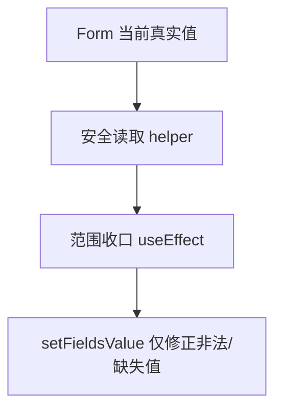

# 变更提案: fix-range-form-initialization

## 元信息
```yaml
类型: 修复
方案类型: implementation
优先级: P1
状态: 已确认
创建: 2026-04-21
```

---

## 1. 需求

### 背景
武器范围规则存在前端初始化竞态。真实数据中 `areaOverride=1`、`areaMode=2`、`shapeType=2` 的武器，在编辑器重新打开后仍可能显示为圆形。排查后发现问题不在磁盘数据，而在表单条件挂载和收口逻辑的组合：未挂载字段的 `useWatch(... ) ?? 默认值` 先参与了自动纠正，导致真实值被前端覆盖。

### 目标
- 修复 `PropertyPanel` 中武器范围/通用范围的初始化覆盖问题。
- 排查并修复同类模式在 `EnemyActionOverridesCard` 等子表单中的影响。
- 为这类“条件挂载字段 + 自动收口”行为补回归测试，防止扇形、范围几体等字段在初始化阶段被错误改写。

### 约束条件
```yaml
时间约束: 本轮直接落地实现和验证
性能约束: 不引入额外深拷贝或高频临时对象
兼容性约束: 保持现有范围协议和保存结构不变
业务约束: 运行时仍只读取显式 shapeType 对应的一套参数，编辑器不得猜测式扩展协议
```

### 验收标准
- [ ] 真实武器数据 `shapeType=2` 时，属性面板重新打开后仍显示扇形，不会被初始化逻辑改回圆形。
- [ ] 同类条件挂载字段在 `EnemyActionOverridesCard` 中不会因默认 watch 值参与收口而覆盖真实数据。
- [ ] 新增测试覆盖初始化场景，能稳定复现并防止回归。

---

## 2. 方案

### 技术方案
把“收口逻辑”从“依赖 `useWatch` 默认值”改为“依赖表单内当前真实值”。核心做法：
- 提取一个安全读取表单字段的 helper，优先读取 `form.getFieldValue` 的真实值，只在字段确实缺失时才使用语义默认值。
- `PropertyPanel` 的通用范围和武器范围 `useEffect` 改为基于真实表单值收口，避免条件挂载字段尚未注册时用 `0/1` 默认值提前纠正。
- `EnemyActionOverridesCard` 同步采用相同读取/收口策略，避免子表单在选择项切换和条件挂载时重复踩坑。
- 增加面向初始化行为的组件测试，直接覆盖 `shapeType=2`、`areaTargetCount>0` 等真实数据场景。

### 影响范围
```yaml
涉及模块:
  - PropertyPanel: 修复武器/通用范围表单初始化与自动收口
  - EnemyActionOverridesCard: 修复敌人行动覆盖子表单的同类问题
  - 面板测试: 新增初始化回归测试
预计变更文件: 4
```

### 风险评估
| 风险 | 等级 | 应对 |
|------|------|------|
| 收口逻辑改动影响原有自动纠正行为 | 中 | 保留既有规则，只调整读取来源，不改协议本身 |
| 子表单切换时读取旧 key 残留值 | 中 | 统一用当前路径读取并在测试中覆盖切换场景 |
| 大组件 `PropertyPanel` 回归面过大 | 中 | 只聚焦范围字段分支，配测试约束行为 |

---

## 3. 技术设计

### 架构设计


### 数据模型
| 字段 | 类型 | 说明 |
|------|------|------|
| shapeType | number | 真实协议字段，决定当前激活形状 |
| areaMode | number | 范围模式，决定是否显示形状与几体 |
| areaOverride | number | 武器范围是否覆盖技能范围 |
| areaTargetCount | number | 范围目标数，范围模式下需保持 >=1 |

---

## 4. 核心场景

### 场景: 武器范围表单初始化
**模块**: PropertyPanel
**条件**: `Weapons.json` 条目已有 `areaOverride=1`、`areaMode=2`、`shapeType=2`
**行为**: 重新打开编辑器并进入该武器条目
**结果**: 面板显示“扇形”，不被默认值覆盖成“圆形”

### 场景: 敌人行动覆盖切换技能
**模块**: EnemyActionOverridesCard
**条件**: 某个 `actionOverrides[skillId]` 已有范围形状字段
**行为**: 切换选中的 skillId 并渲染条件字段
**结果**: 当前 skillId 的真实范围配置被保留，不会在切换时被自动改写

---

## 5. 技术决策

### fix-range-form-initialization#D001: 收口逻辑基于表单真实值而非 watch 默认值
**日期**: 2026-04-21
**状态**: ✅采纳
**背景**: 条件挂载字段在初始化阶段未注册时，`useWatch(... ) ?? 默认值` 会把“缺失观察值”伪装成真实值，提前触发收口逻辑，覆盖磁盘里的合法配置。
**选项分析**:
| 选项 | 优点 | 缺点 |
|------|------|------|
| A: 延迟执行 useEffect，等字段挂载后再收口 | 改动小 | 依赖时序，后续仍容易被同类问题击穿 |
| B: 收口逻辑统一读取表单当前真实值，再决定是否修正 | 根因层修复，可复用于同类表单 | 需要调整多处读取逻辑并补测试 |
**决策**: 选择方案 B
**理由**: 这次问题本质不是时机太早，而是读取来源错了。只要仍拿默认 watch 值当真实值，同类字段在别处还会继续出问题。
**影响**: 影响 `PropertyPanel`、`EnemyActionOverridesCard` 和相关测试

---

## 6. 成果设计

N/A，本次为前端行为修复，不涉及视觉风格改版。
