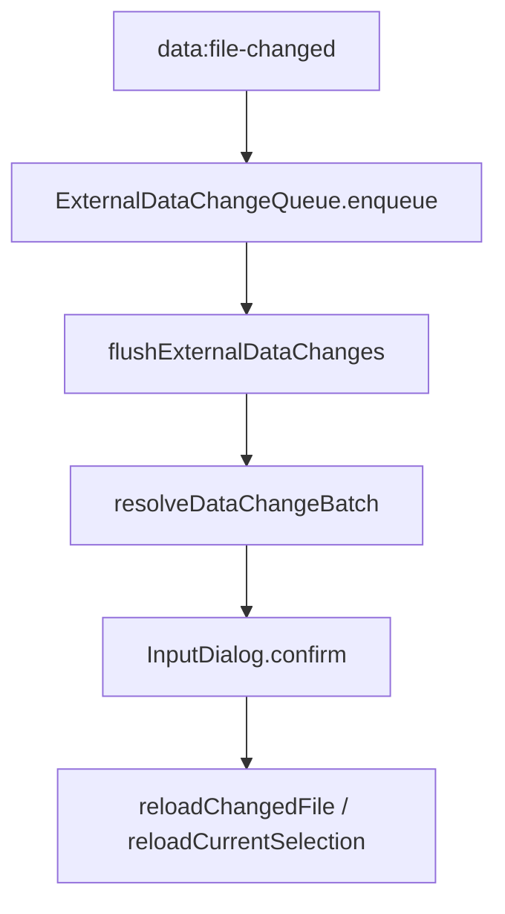

# 变更提案: fix-external-change-prompt-dedup

## 元信息
```yaml
类型: 修复
方案类型: implementation
优先级: P1
状态: 已确认
创建: 2026-04-21
```

---

## 1. 需求

### 背景
编辑器已具备外部文件监听和重载确认，但当前实现只对“单次出队批次”做 `Map` 去重。确认弹窗打开期间，如果同一文件再次触发 `data:file-changed`，新事件会重新进入下一轮 `while`，导致用户点完一个提示后又弹出一个近似重复的提示。多文件在短时间内连续变化时，也容易被拆成多个相邻批次，聚合不够稳定。

### 目标
- 修复同一文件在一次外部变更处理会话内重复弹窗的问题。
- 收紧同批次多文件变更的聚合策略，减少短时间内连续弹出多轮近似提示。
- 为队列去重与聚合行为补回归测试，保证后续新增依赖文件时不会重新引入提示风暴。

### 约束条件
```yaml
时间约束: 本轮直接落地实现和验证
性能约束: 不引入高频深拷贝或长生命周期大对象
兼容性约束: 保持现有外部文件重载规则、提示文案和 reload 决策不变
业务约束: 用户取消当前提示后，不应被同一轮已观测到的重复变更立即再次打断
```

### 验收标准
- [ ] 同一数据文件在一次确认/重载处理会话内即便多次触发监听，也只产生一次对应提示。
- [ ] 多个文件在短时间内连续变化时，会尽量合并成单轮或更少轮的批次确认，而不是连续弹出近似重复提示。
- [ ] 新增测试覆盖路径标准化去重、会话内抑制、冷却后重新入队等行为。

---

## 2. 方案

### 技术方案
把“外部文件监听队列”从 `useFileOperations` 内联状态提升为一个小型可测试服务，专门负责三件事：
- 按标准化路径聚合待处理事件；
- 在当前确认/重载会话内抑制同一路径的重复入队；
- 在一次处理结束后保留一个很短的冷却窗口，吞掉编辑器保存时常见的尾随重复事件。

`useFileOperations` 继续保留现有 reload 决策和提示文案，只改为通过该队列取批次，并在每轮确认完成后为下一轮批次增加一个短暂聚合窗口，让同时写入的多文件更容易合并。

### 影响范围
```yaml
涉及模块:
  - useFileOperations: 外部变更监听、批次确认与重载队列
  - ExternalDataChangeQueue: 新增外部文件变更聚合与抑制服务
  - BaseDataReloadService: 继续承担 reload 规则判定，不调整业务语义
  - 前端测试: 新增外部变更队列回归测试
预计变更文件: 4
```

### 风险评估
| 风险 | 等级 | 应对 |
|------|------|------|
| 冷却窗口过长导致真实后续修改被延迟提示 | 中 | 仅使用短 TTL，且只抑制同一路径的重复事件 |
| 新队列层与现有批次判定职责重叠 | 低 | 保持队列只管聚合/去重，reload 影响判定仍留在 `BaseDataReloadService` |
| 用户取消提示后遗漏需要关注的其他文件 | 低 | 仅抑制同一路径重复事件，不抑制新路径事件；新路径仍可进入下一轮批次 |

---

## 3. 技术设计

### 架构设计


### 数据模型
| 字段 | 类型 | 说明 |
|------|------|------|
| pending | Map<string, DataFileChangePayload> | 当前待处理批次，按标准化路径去重 |
| sessionSuppressedPaths | Set<string> | 当前处理会话内已提示/已处理的路径，防止重复弹窗 |
| recentlyHandledAt | Map<string, number> | 最近处理时间戳，用于吞掉尾随重复事件 |
| duplicateTtlMs | number | 同一路径短时冷却窗口 |

---

## 4. 核心场景

### 场景: 同一文件重复写入
**模块**: useFileOperations / ExternalDataChangeQueue
**条件**: `Weapons.json` 在一次监听处理期间连续收到多次 `write`
**行为**: 用户确认首个外部变更提示
**结果**: 不会在首个提示关闭后立刻再弹出第二个 `Weapons.json` 提示

### 场景: 多文件短时间连续写入
**模块**: useFileOperations / ExternalDataChangeQueue
**条件**: `Animations.json`、`Weapons.json`、`Skills.json` 在短时间内连续触发监听
**行为**: 编辑器处理外部变更
**结果**: 相邻写入会尽量被聚合到更少轮批次确认中，新路径不会被同一路径抑制误吞

---

## 5. 技术决策

### fix-external-change-prompt-dedup#D001: 在队列层做“会话抑制 + 短时冷却”，而不是仅在弹窗后清空 Map
**日期**: 2026-04-21
**状态**: ✅采纳
**背景**: 现有实现只在单批次出队时用 `Map` 去重，无法覆盖“确认框打开期间再次收到相同文件事件”的情况。
**选项分析**:
| 选项 | 优点 | 缺点 |
|------|------|------|
| A: 仅在 `flushExternalDataChanges` 里追加条件判断 | 改动小 | 逻辑仍分散在 hook 内，不易测试，后续容易回归 |
| B: 提取专用队列服务，负责聚合、会话抑制和冷却策略 | 职责清晰，可单测覆盖真实问题链路 | 需要新增一个小服务文件 |
**决策**: 选择方案 B
**理由**: 这类问题本质是“事件队列语义”缺失，而不是单次批处理条件不全。把状态机收口到一个小服务里，后续扩展其他监听策略时也更安全。
**影响**: 影响 `useFileOperations` 的外部变更处理链路，以及相关测试

---

## 6. 成果设计

N/A，本次为前端行为修复，不涉及视觉设计改版。
