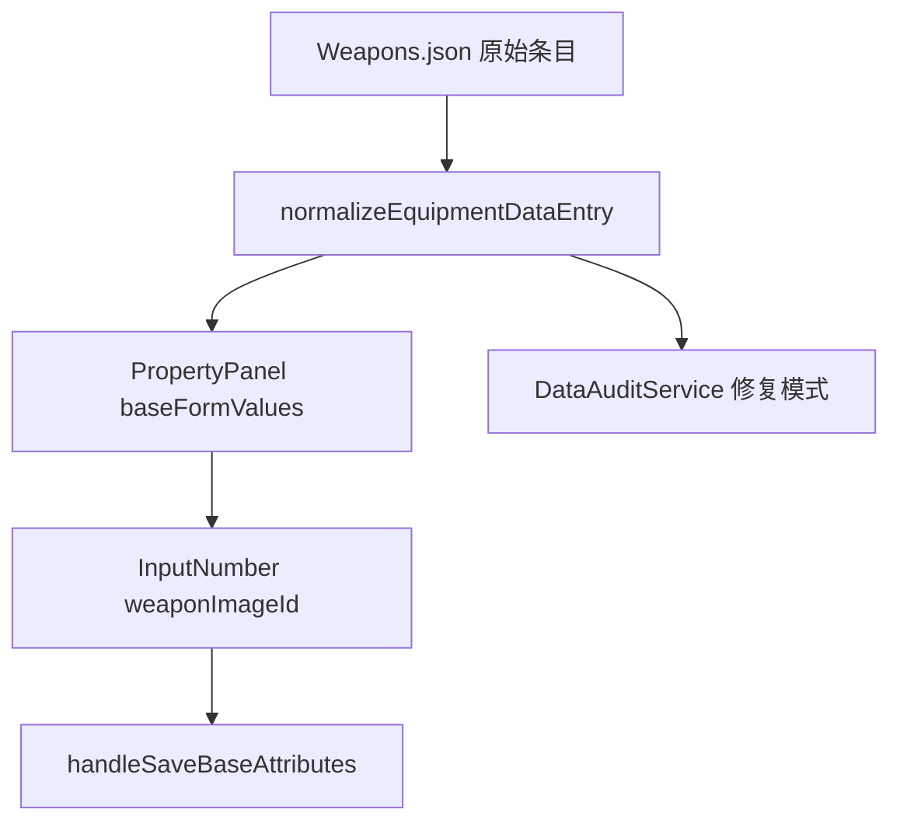

# 变更提案: add-weapon-image-id-field

## 元信息
```yaml
类型: 修复
方案类型: implementation
优先级: P1
状态: 已确认
创建: 2026-04-21
```

---

## 1. 需求

### 背景
当前武器数据的属性面板没有直接暴露 `weaponImageId`，但业务需要把它作为武器顶层字段维护，而不是继续通过备注或其他旁路协议写入。与此同时，修复模式也还没有把缺失该字段的历史武器条目补齐。

### 目标
- 在 `Weapons.json` 的属性面板“基础属性”区追加 `weaponImageId` 输入项。
- 输入规则固定为 `>=1` 的整数，并直接写回武器顶层 `weaponImageId` 字段。
- 修复模式补齐缺失的 `weaponImageId`，默认值为 `1`。

### 约束条件
```yaml
时间约束: 本轮直接落地实现和验证
性能约束: 不引入新的高频副作用或额外扫描链路
兼容性约束: 不改变现有武器范围、模板参数、自动保存链路
业务约束: 当前数据里不存在负数和非整数脏值，本轮只需保证字段缺失时补为 1
```

### 验收标准
- [ ] 武器属性面板“基础属性”区显示 `weaponImageId` 数字输入，且只接受 `>=1` 的整数。
- [ ] 修改后字段通过现有基础属性保存链路写回武器顶层 `weaponImageId`。
- [ ] 修复模式会把缺失 `weaponImageId` 的武器补齐为 `1`。

---

## 2. 方案

### 技术方案
沿用现有武器协议补齐和属性面板自动保存链路：
- 在 `EquipmentPropertyService` 中把 `weaponImageId` 纳入武器标准化字段，默认补为 `1`；
- 在 `PropertyPanel` 的武器基础属性区回填、显示并保存该字段；
- 在 `DataAuditService` 中继续复用武器标准化逻辑，让修复模式自动补齐缺失字段；
- 补充协议级、面板级和修复模式级测试。

### 影响范围
```yaml
涉及模块:
  - EquipmentPropertyService: 武器结构化字段补齐
  - PropertyPanel: 武器基础属性编辑与自动保存
  - DataAuditService: 修复模式补字段
  - 前端测试: 补充武器字段显示和修复模式断言
预计变更文件: 5
```

### 风险评估
| 风险 | 等级 | 应对 |
|------|------|------|
| 面板字段接入后与现有自动保存链路不一致 | 中 | 直接接入 `baseFormValues + handleSaveBaseAttributes` 现有武器保存路径 |
| 修复模式补字段后引发无关武器条目重写 | 低 | 只依赖既有 `normalizeEquipmentDataEntry` 的最小补齐规则 |
| UI 输入和协议默认值不一致 | 低 | UI `min=1`，保存和标准化统一按 `>=1` 收口 |

---

## 3. 技术设计

### 架构设计


### 数据模型
| 字段 | 类型 | 说明 |
|------|------|------|
| weaponImageId | number | 武器顶层图片 id，当前协议要求为 `>=1` 的整数 |

---

## 4. 核心场景

### 场景: 武器基础属性面板编辑图片 id
**模块**: PropertyPanel
**条件**: 当前条目为 `Weapons.json` 武器
**行为**: 在基础属性区修改 `weaponImageId`
**结果**: 新值通过现有基础属性自动保存链路写回武器顶层字段

### 场景: 修复模式补齐历史武器字段
**模块**: DataAuditService
**条件**: 历史武器条目缺失 `weaponImageId`
**行为**: 执行“数据体检/修复”
**结果**: 该武器会被补齐 `weaponImageId: 1`

---

## 5. 技术决策

### add-weapon-image-id-field#D001: `weaponImageId` 作为武器顶层正式字段维护
**日期**: 2026-04-21
**状态**: ✅采纳
**背景**: 该字段需要进入属性面板和修复模式的正式协议，不再依赖备注或临时兼容层。
**选项分析**:
| 选项 | 优点 | 缺点 |
|------|------|------|
| A: 继续放在备注 / meta 扩展里 | 改动看似小 | 与当前结构化编辑器方向冲突，修复模式和保存链难统一 |
| B: 作为武器顶层字段进入标准化、编辑和修复链路 | 协议清晰，保存/修复路径统一 | 需要补 UI 与测试 |
**决策**: 选择方案 B
**理由**: 这类武器运行时字段已经不适合继续藏在备注里。顶层结构化字段更符合当前编辑器“修复模式补协议，运行时直接信任结构”的路线。
**影响**: 影响武器标准化、属性面板基础属性区和数据修复模式

---

## 6. 成果设计

N/A，本次为结构化字段与面板行为补充，不涉及视觉设计改版。
