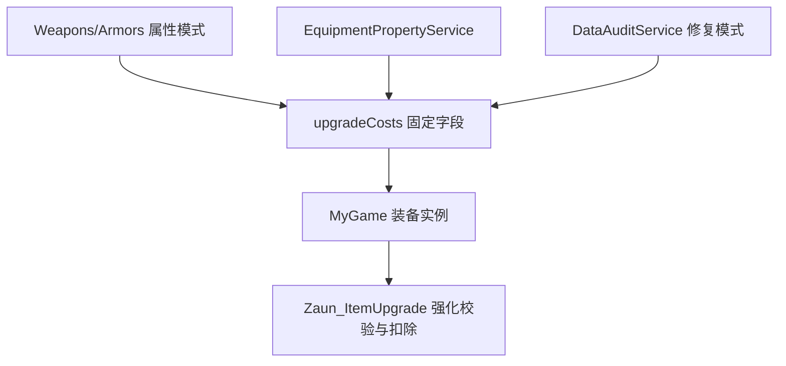

# 变更提案: equipment-upgrade-costs

## 元信息
```yaml
类型: 新功能
方案类型: implementation
优先级: P1
状态: 已选择方案
创建: 2026-04-24
```

---

## 1. 需求

### 背景
`MyGame/js/plugins/Zaun_ItemUpgrade.js` 当前通过全局插件参数维护人类/战车强化金币和保底物品列表。这会把强化消耗从具体装备数据中拆出去，导致每件武器/防具无法独立配置强化条件，也不符合当前编辑器由固定字段维护装备协议、运行时直接消费 canonical 数据的约定。

### 目标
- 在 `Weapons.json` 和 `Armors.json` 顶层新增固定字段 `upgradeCosts`。
- `upgradeCosts` 严格逐级配置，数组下标对应 `nextLevel - 1`。
- 每一级支持编辑强化金币、必需物品及数量、保底物品及数量。
- 金币和必需物品在强化成功/失败时都消耗。
- 保底物品仅在玩家选择保底且数量足够时消耗，并使本次强化成功率变为 100%。
- `MyNewEditor` 属性模式负责编辑与保存该字段；修复模式在武器/防具缺字段时补 `upgradeCosts: []`。
- `MyGame` 运行时不再使用 `Zaun_ItemUpgrade.js` 的默认插件参数控制强化消耗。

### 约束条件
```yaml
性能约束: 运行时按数组下标读取已存在对象，不做运行时结构补齐或复杂兜底。
兼容性约束: 旧数据需要先经过编辑器修复模式补齐字段；运行时不保留插件参数业务兜底。
业务约束: 武器/防具使用同一字段结构；不写入 EquipExtensions.json。
权限约束: 当前会话可直接写 MyNewEditor；MyGame 不在可写范围内，运行时改动需输出补丁说明或由用户切换工作区后实施。
```

### 验收标准
- [ ] 武器/防具标准化后固定包含 `upgradeCosts` 字段。
- [ ] 属性模式可按强化等级编辑 `goldCost / requiredItemId / requiredItemAmount / protectItemId / protectItemAmount`。
- [ ] 保存属性时 `upgradeCosts` 写回当前武器/防具条目，并进入现有 SaveAll 链路。
- [ ] 修复模式对缺失字段的武器/防具补 `upgradeCosts: []`。
- [ ] Bun 类型检查和相关测试通过。
- [ ] 生成 `MyGame` 运行时补丁说明，覆盖金币、必需耗材、保底耗材的读取、校验、扣除和展示改动。

---

## 2. 方案

### 技术方案
采用方案 A：在装备顶层新增 `upgradeCosts` 固定数组。`upgradeParams` 继续只表达强化属性增量和强化次数上限；`upgradeCosts` 只表达强化消耗。编辑器补齐和保存 canonical 字段，运行时按 `item.upgradeCosts[nextLevel - 1]` 读取对应等级消耗。

推荐数据结构：
```ts
interface EquipUpgradeCostEntry {
  goldCost: number;
  requiredItemId: number;
  requiredItemAmount: number;
  protectItemId: number;
  protectItemAmount: number;
}
```

### 影响范围
```yaml
涉及模块:
  - MyNewEditor 类型定义: 新增 EquipUpgradeCostEntry 和 RPGItem.upgradeCosts
  - MyNewEditor EquipmentPropertyService: 武器/防具标准化与空字段补齐
  - MyNewEditor PropertyPanel: 属性模式新增强化耗材卡片
  - MyNewEditor DataAuditService: 修复模式补缺失字段
  - MyNewEditor 测试: 标准化、修复和 UI 保存回归
  - MyGame Zaun_ItemCore: 装备实例复制 upgradeCosts
  - MyGame Zaun_ItemUpgrade: 消耗读取从插件参数改为装备字段
预计变更文件: MyNewEditor 5-7 个；MyGame 2 个补丁说明
```

### 风险评估
| 风险 | 等级 | 应对 |
|------|------|------|
| 运行时先更新但数据未修复，旧装备缺 `upgradeCosts` | 高 | 明确发布顺序：先用编辑器修复/保存数据，再更新运行时；运行时不做旧插件参数兜底 |
| 编辑器行数和强化上限不一致 | 中 | UI 按 `upgradeParams.times.value` 显示建议等级；保存保持用户明确配置，缺级在运行时视为数据配置问题 |
| MyGame 当前不可写 | 中 | 本轮直接完成 MyNewEditor，并输出 MyGame 补丁说明；用户切换可写工作区后再落地运行时 |

---

## 3. 技术设计

### 架构设计


### 数据模型
| 字段 | 类型 | 说明 |
|------|------|------|
| `upgradeCosts` | `EquipUpgradeCostEntry[]` | 武器/防具顶层固定字段，严格逐级配置 |
| `goldCost` | `number` | 当前等级强化金币，成功/失败都消耗 |
| `requiredItemId` | `number` | 必需耗材物品 ID，0 表示无 |
| `requiredItemAmount` | `number` | 必需耗材数量，成功/失败都消耗 |
| `protectItemId` | `number` | 保底物品 ID，0 表示无 |
| `protectItemAmount` | `number` | 保底物品数量，仅启用保底时消耗 |

---

## 4. 核心场景

### 场景: 编辑武器强化消耗
**模块**: MyNewEditor 属性模式  
**条件**: 当前文件为 `Weapons.json` 或 `Armors.json`  
**行为**: 用户在“强化耗材”卡片中逐级配置金币、必需物品、保底物品和数量  
**结果**: 当前装备条目写回 `upgradeCosts` 并标记数据文件为脏

### 场景: 修复旧装备数据
**模块**: MyNewEditor 修复模式  
**条件**: 武器/防具条目缺少 `upgradeCosts`  
**行为**: 修复链标准化装备条目  
**结果**: 条目补 `upgradeCosts: []`，不做业务默认推断

### 场景: 运行时强化扣除
**模块**: MyGame `Zaun_ItemUpgrade.js`  
**条件**: 玩家选择装备并执行强化  
**行为**: 运行时按 `nextLevel - 1` 读取 `upgradeCosts`，检查并扣除金币和必需耗材；保底启用时额外扣保底耗材  
**结果**: 成功/失败都会消耗金币和必需耗材，保底启用时本次强化成功

---

## 5. 技术决策

### equipment-upgrade-costs#D001: 强化消耗使用装备顶层 `upgradeCosts` 数组
**日期**: 2026-04-24  
**状态**: ✅采纳  
**背景**: 强化消耗需要从全局插件参数切换为每个武器/防具独立配置。  
**选项分析**:
| 选项 | 优点 | 缺点 |
|------|------|------|
| A: 顶层 `upgradeCosts` 数组 | 职责清晰，读取快，严格逐级无需查找 | 需要新增字段和修复链 |
| B: `upgradeCostLevels` 带 level 字段 | 可读性强 | 运行时要校验/查找 level，增加判断 |
| C: 扩展 `upgradeParams` | 字段集中 | 混淆属性增量和消耗职责，迁移风险高 |
**决策**: 选择方案 A。  
**理由**: 最符合“严格逐级配置、运行时稳定、少兜底判断”的目标，并保持 `upgradeParams` 现有语义不变。  
**影响**: MyNewEditor 负责生成和修复字段；MyGame 运行时按固定字段直接消费。

---

## 6. 成果设计

### 设计方向
- **美学基调**: 沿用现有属性面板深色卡片体系，不引入新视觉体系。
- **记忆点**: 强化等级逐行显示，消耗类型清晰分列。
- **参考**: 现有属性模式固定属性卡片。

### 视觉要素
- **配色**: 复用当前 `Card`、灰色说明文字和强调色标题。
- **字体**: 复用项目现有字体。
- **布局**: 在固定属性卡片后新增“强化耗材”卡片，按等级行展示金币、必需耗材、保底耗材。
- **动效**: N/A。
- **氛围**: N/A。

### 技术约束
- **可访问性**: 下拉选择和数量输入保留明确 label。
- **响应式**: 沿用当前属性面板网格布局。
