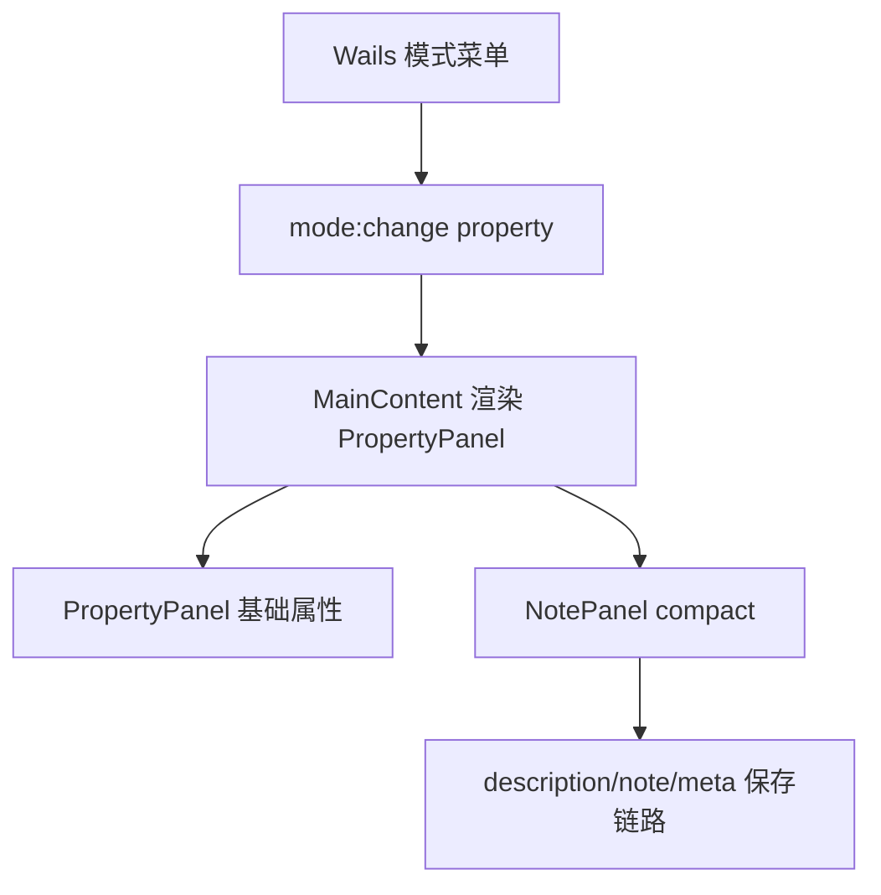

# 变更提案: note-to-property-mode

## 元信息
```yaml
类型: 新功能/修复/优化
方案类型: implementation
优先级: P1
状态: 已规划
创建: 2026-05-02
```

---

## 1. 需求

### 背景
编辑器当前把备注编辑放在独立 `note` 模式中，用户需要在属性和备注之间切换。备注面板内的描述、备注和元数据预览三个区块面积偏大；描述编辑保存时会过滤空行，输入 Enter 后保存逻辑触发数据回写，随后组件从来源数据重新同步编辑态，导致换行位置被立即切回第一行。

### 目标
- 移除独立备注模式入口，把备注编辑、描述编辑和元数据预览整合到属性模式内。
- 缩小描述模块、备注模块、元数据预览模块的占用面积，使其成为属性模式里的紧凑辅助区块。
- 修复描述模块 Enter 换行后光标/内容回到第一行的问题，保留用户输入的空行编辑态。

### 约束条件
```yaml
时间约束: 无
性能约束: 不引入新的大对象轮询或额外全量数据扫描
兼容性约束: 保持现有 note、meta、description 数据字段协议；保存路径仍通过现有 loadData/markDirty 链路
业务约束: 不迁移或删除用户数据；仅迁移编辑入口与 UI 组织方式
```

### 验收标准
- [ ] 应用菜单不再提供“备注模式”，F4 不再切换到独立 `note` 模式。
- [ ] 属性模式中可直接编辑 `description`、`note`，并可查看由备注解析出的元数据预览。
- [ ] 描述输入按 Enter 后保留换行和光标上下文，不会立即回到第一行。
- [ ] 描述、备注、元数据预览三个区块比原三列全高布局更紧凑。
- [ ] TypeScript 构建或类型检查通过。

---

## 2. 方案

### 技术方案
将 `NotePanel` 调整为可复用的紧凑组件，并在 `PropertyPanel` 顶部基础属性区之后渲染。`NotePanel` 不再作为 `MainContent` 的独立模式分支入口；Go 菜单移除“备注模式”项。描述保存不再丢弃空行，组件同步逻辑在本地存在未提交编辑时不覆盖输入框状态，从源头避免 Enter 后重置。

### 影响范围
```yaml
涉及模块:
  - frontend/src/components/panels/NotePanel.tsx: 复用为属性模式内的紧凑备注区块并修复描述换行
  - frontend/src/components/panels/PropertyPanel.tsx: 嵌入备注区块
  - frontend/src/components/layout/MainContent.tsx: 移除独立 note 面板渲染路径
  - app.go: 移除菜单中的备注模式入口
  - frontend/src/types/index.ts: 收口前端 EditorMode 类型中的 note
  - backend/models/models.go: 收口后端 EditorMode 常量中的 note
  - frontend/src/services/BaseDataReloadService.ts: 收口属性依赖判断中的 note 分支
预计变更文件: 7
```

### 风险评估
| 风险 | 等级 | 应对 |
|------|------|------|
| 旧代码仍发出 `mode:change` 的 `note` | 中 | 前端监听层将未知/旧 note 请求映射到 `property` |
| 属性面板已经较长，新增区块影响滚动体验 | 中 | 备注区块采用紧凑标题、固定较小行数和两列布局 |
| 描述空行保存影响运行时展示 | 低 | 仅保留用户明确输入的换行；不改变字段类型，仍为 `description: string[]` |

---

## 3. 技术设计

### 架构设计


### 数据模型
| 字段 | 类型 | 说明 |
|------|------|------|
| description | string[] | 描述行数组，编辑器按换行拆分保存 |
| note | string | RPG Maker 备注文本 |
| meta | Record<string, unknown> | 由 note 中 Meta 标签解析并同步 |

---

## 4. 核心场景

### 场景: 属性模式内编辑备注
**模块**: 前端属性面板  
**条件**: 已打开普通数据库条目并处于属性模式  
**行为**: 用户在属性面板中编辑描述或备注  
**结果**: 条目数据被标记 dirty，保存时写回原数据文件；元数据预览同步展示解析结果。

### 场景: 描述换行
**模块**: 备注编辑区块  
**条件**: 用户焦点在描述输入框中  
**行为**: 用户按 Enter 新增空行或继续输入下一行  
**结果**: 输入框保留当前编辑内容，不被来源数据同步覆盖。

---

## 5. 技术决策

### note-to-property-mode#D001: 移除独立备注模式入口
**日期**: 2026-05-02  
**状态**: ✅采纳  
**背景**: 用户确认按“移除独立备注模式入口，把备注编辑/预览整合到属性模式内”处理。  
**选项分析**:
| 选项 | 优点 | 缺点 |
|------|------|------|
| A: 移除独立入口并嵌入属性模式 | 工作流更集中，减少模式切换，符合用户选择 | 属性面板内容增加 |
| B: 保留入口但复用组件 | 兼容旧入口 | 仍保留用户想迁移掉的模式概念 |
**决策**: 选择方案 A  
**理由**: 属性模式是条目结构化编辑的主入口，备注和描述属于同一条目的基础文本/元数据编辑，放在同一面板更符合当前编辑流。  
**影响**: `app.go` 菜单、`MainContent` 模式分支、`EditorMode` 类型和属性面板布局。

---

## 6. 成果设计

### 设计方向
- **美学基调**: 工具型高密度编辑界面，压低辅助文本区块的视觉重量，让主属性编辑保持优先级。
- **记忆点**: 属性模式顶部即可看到紧凑的“文本与备注”编辑区，不再像独立页面一样占满三列全高。
- **参考**: 现有暗色 Ant Design + Tailwind 面板风格。

### 视觉要素
- **配色**: 延续现有 `#1a1f2e` 面板、`#252b3d` 标题栏、cyan 强调色。
- **字体**: 复用项目当前 JetBrains Mono/Fira Code 配置。
- **布局**: 紧凑两列输入区 + 窄元数据预览区，固定较小 textarea 行数，避免全高三列占位。
- **动效**: 不新增动效，保持工具编辑稳定性。
- **氛围**: 保持现有暗色边框与低对比辅助说明，减少说明文字占位。

### 技术约束
- **可访问性**: 保留标签和 placeholder；输入区仍使用 Ant Design TextArea。
- **响应式**: 宽屏三列，窄屏自然折叠为单列。
