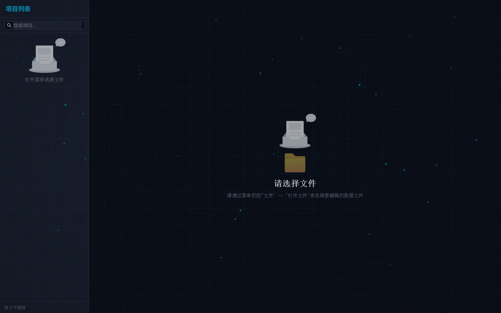

# RM Data Workbench

RM Data Workbench is a desktop editor for RPG Maker project data. It is built for game projects that have grown beyond the default RPG Maker database UI and need safer, faster editing for large JSON datasets, custom plugin schemas, and project-specific balance data.

This is the Wails/Go/React rewrite of my earlier Electron RPG data editor, now opened as an OSS project.

The project is a Wails v2 application: a Go backend provides filesystem, workspace, and persistence services, while a React + TypeScript frontend provides structured editors, Monaco-based raw JSON editing, and visual preview panels.

## Purpose

RPG Maker stores most game content in JSON files under a project's `data/` directory. That works well for the engine, but it becomes hard to maintain when a project adds custom systems such as quests, projectile templates, equipment extensions, map metadata, enemy behavior overrides, or complex skill/effect formulas.

RM Data Workbench focuses on that workflow:

- open and validate an RPG Maker project workspace;
- discover and edit standard RPG Maker data files such as `Actors.json`, `Classes.json`, `Enemies.json`, `Items.json`, `Skills.json`, `States.json`, `Weapons.json`, `Armors.json`, `Troops.json`, `System.json`, and map files;
- support custom project files such as `Quests.json`, `Projectiles.json`, `Effects.json`, and `EquipExtensions.json`;
- provide structured editing panels for common game-design tasks while keeping raw JSON editing available through Monaco Editor;
- preserve project-local files on disk instead of moving data into an opaque database;
- help migrate an earlier Electron-based editor to a smaller Wails + Go + React desktop application.

## Screenshot



## Current capabilities

- RPG Maker workspace detection and recent-workspace persistence.
- Data-file discovery for core database files, optional custom files, and map files.
- File read/write services exposed from Go to the TypeScript frontend through Wails bindings.
- Structured panels for properties, effects, quests, projectiles, maps, equipment, refit data, drops, notes, and enemy action overrides.
- Automatic default creation for supported custom data files when they are missing.
- External data-file change detection with local-write suppression.
- Monaco Editor integration for direct JSON/script editing.
- Zustand-based editor state, dirty-file tracking, and project configuration persistence.
- Vitest tests for data normalization, editor services, and panel behavior.

## Technology stack

- Desktop shell: Wails v2
- Backend: Go
- Frontend: React 18, TypeScript, Vite
- Package manager: Bun
- UI: Ant Design, Tailwind CSS
- State management: Zustand
- Editors and previews: Monaco Editor, PixiJS
- Tests: Vitest, Testing Library

## Repository layout

```text
.
├── app.go                     # Wails application bridge and desktop integration
├── main.go                    # Application entry point
├── backend/
│   ├── models/                # Shared backend data models
│   └── services/              # Workspace, file, and quest services
├── frontend/
│   ├── src/components/        # Layout, panels, and reusable UI
│   ├── src/services/          # Data loading, normalization, and editor services
│   ├── src/stores/            # Zustand state
│   ├── src/types/             # RPG Maker and custom schema types
│   └── wailsjs/               # Generated Wails bindings
└── wails.json                 # Wails project configuration
```

## Development

Install frontend dependencies:

```bash
cd frontend
bun install
```

Run the desktop app in live-development mode from the repository root:

```bash
wails dev
```

Build a redistributable desktop package:

```bash
wails build
```

Run frontend checks:

```bash
cd frontend
bun run test
bun run build
```

Run backend tests from the repository root:

```bash
go test ./...
```

## Why this repository is a good Codex for OSS candidate

This codebase is a practical desktop tool intended for open-source collaboration rather than a toy example. It has real cross-language boundaries, persistent user data, large JSON schemas, domain-specific editors, and regression tests around data transformation behavior. Useful Codex work in this repository includes:

- expanding structured editors for additional RPG Maker and plugin data files;
- improving schema normalization and repair logic without corrupting project data;
- strengthening tests around edge cases in game-balance data;
- migrating legacy Electron editor behavior into the Wails application;
- improving Go/TypeScript bridge safety and frontend state consistency;
- refining desktop packaging and release workflows.

## Roadmap

- Add undo/redo support for structured edits.
- Expand validation and repair tooling for RPG Maker database files.
- Improve custom schema documentation for quests, projectiles, effects, and equipment extensions.
- Add broader integration tests for workspace reload and external file-change flows.

## License

This project is licensed under the Mozilla Public License 2.0. See [LICENSE](LICENSE).

When redistributing this project or a derived executable, keep the attribution notices in [NOTICE](NOTICE).